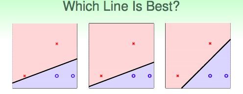

# Lecture 1：Linear Support Vector Machine

> **课件链接：**[Hsuan-Tien Lin - linear support vector machine](<https://www.csie.ntu.edu.tw/~htlin/course/ml19spring/doc/201_handout.pdf>)
>
> **Linear Support Vector Machine(线性支撑向量机)：**
>
> * Large-Margin Separating Hyperplane: 大间隔分离超平面；
> * Standard Large-Margin Problem: 标准大间隔问题；
> * Support Vector Machine: 支撑向量机；
> * Reasons behind Large-Margin Hyperplane: 大间隔超平面的直觉。

## 1. Large-Margin Separating Hyperplane: 大间隔分离超平面

> 本讲(共4节)假设，训练资料集是**线性可分的(Linear Seperable)**——在原空间(X空间)中存在一个线性分离超平面，能够将训练资料集中的样本点根据各自类别100%正确地划分开来。 

**哪一个最好？**

PLA与pocket算法是《机器学习基石》中介绍的两种解决二元分类问题($y \in \{-1, +1\}$)的算法。它们最终回传的hypothesis均为线性超平面，可以写作：
$$
h(\mathbf{x}) = sign(\mathbf{w}^T \mathbf{x})
$$
下面三个基于训练资料集训练出的线性分类器，哪一个最好？

一样好，因为：

1. PLA或pocket算法可能回传其中任何一条直线——因为PLA与pocket回传的直线本身就具有随机性，与w的初始值、每次挑出的错分样本有关；
2. 三条线的VC Bound相同——三条线的$E_{in}$均为0，且$\Omega$都一样(因为三条直线对应的假说集合$\mathcal{H}$是一样的，$\Omega$是$\mathcal{H}$的函数)。

然而，大多数人都会认为最右边的直线最好。一种非正式的解释如下：

* 如果测试资料的$\mathbf{x}$是在训练资料的$\mathbf{x}$上添加了一些杂讯而得到的，例如存在测量误差，那么我们一定希望测试资料的输出y应该同训练资料的标签y一致；
* 如果样本点离分离超平面越远，那么就意味着能够容忍更大的上述杂讯——如果很近，那么一丁点的杂讯，就会使测试样本点越过分离超平面，从而被分类器分到另外一类中去，导致错误；
* 容忍更大的杂讯，也就意味着鲁棒性更强(more robust)——因为杂讯是造成过拟合的主要原因之一，容忍杂讯等于不易过拟合；
* 因此，"离最近点最远的分离超平面"是最好的分离超平面——larger distance to closest $\mathbf{x}_n$。

**Fatness = Margin**

"离最近点最远的分离超平面"，也就是"最胖的分离超平面"。一个分离超平面的胖的程度(fatness)，体现了它的鲁棒性(robustness)，可以用它到最近点$\mathbf{x}_n​$的距离来衡量：

在机器学习中，分离超平面的fatness被称为**margin**。因此，我们希望找到margin最大的分离超平面作为我们的分类器——**find largest-margin separating hyperplane**。即，我们需要解决如下的最优化问题：

- 约束条件1：保证所有样本点分类正确；
- 约束条件2：定义了margin。

## 2. Standard Large-Margin Problem: 标准大间隔问题

此前，我们在表示线性模型时，一直悄悄地在$\mathbf{x}​$中增加了第0维，即$x_0=1​$，同时在$\mathbf{w}​$中也相应添加了$w_0​$表示截距项。在SVM的相关领域中，我们将去掉第0维，并把$w_0​$拿出，单独记做$b​$。此时，hypothesis记做：
$$
h(\mathbf{x}) = sign(\mathbf{w}^T \mathbf{x}+b)
$$
**点到超平面的距离公式**
$$
distance(\mathbf{x},b,\mathbf{w}) = \frac{|\mathbf{w}^T \mathbf{x}+b|}{||\mathbf{w}||}
$$
由于我们考虑的分离超平面是100%分类正确的超平面，因此对于每个样本点n，有：
$$
y_n(\mathbf{w}^T\mathbf{x}_n + b) > 0
$$
因此，在本问题中，点到分离超平面的距离又可以写作：
$$
distance(\mathbf{x}_n,b,\mathbf{w}) = \frac{1}{||\mathbf{w}||}y_n(\mathbf{w}^T \mathbf{x}+b)
$$
将上式代入上一节最后的最优化问题中，问题转化为：

**放缩无害**

易知，超平面$\mathbf{w}^T \mathbf{x}+b = 0$和超平面$3\mathbf{w}^T \mathbf{x}+3b=0$实质是同一个超平面。因此，对于$\mathbf{w}$和$b$进行相同尺度的放缩，超平面不变。所以，我们可能不必考虑所有的$\mathbf{w}$和$b$，而只需考虑满足下式的$\mathbf{w}$和$b$：
$$
\underset{n=1,\cdots,N}{min}\ y_n(\mathbf{w}^T \mathbf{x}_n+b)=1
$$
上式的含义：对于一个固定的超平面，由于它的$\mathbf{w}$和$b$可以放缩，那就干脆进行一个特殊的放缩，使得其满足上式；由于放缩无害，因此问题等价。

为什么要进行上述放缩？因为上述放缩能够使得margin的表达式大大简化：
$$
margin = \frac{1}{||\mathbf{w}||}
$$
同时，约束条件1也被满足——"最小的值等于1，那么每个值一定大于0"。此时，最优化问题转化为：

**放松条件**

然而，现在最优化问题的约束条件是含min运算的式子，实质是一个比较强、比较紧的约束条件，而且不利于我们求解。因此，我们尝试放松该约束条件。考虑条件：
$$
y_n(\mathbf{w}^T \mathbf{x}_n + b) \ge 1\ for\ all\ n
$$
容易知道，该条件是原条件的**必要条件**。因此，如果用该条件替换原条件，问题不一定等价。例如，所有样本点的"y乘分数"(即不等式左侧，$y_n(\mathbf{w}^T \mathbf{x}_n + b)$即分数)都大于等于1.126，该情景虽然满足大于等于1的新条件，但却不满足原条件中"y乘分数"的最小值等于1。但是，我们可以证明，即使将约束条件替换为新条件，最佳解还是会落在比较紧的原条件的约束区域里。若此，替换成新条件的最优化问题与原来的最优化问题完全等价。证明如下：

- 假设最优解$(b, \mathbf{w})$落在原条件(较紧)的约束区域外，例如最优解满足：$y_n(\mathbf{w}^T \mathbf{x}+b) \ge 1.126\ for\ all\ n$；

* 若此，我们可以进行放缩而得到"更优解"：考虑解$(\frac{b}{1.126}, \frac{\mathbf{w}}{1.126})$——该解即满足新条件，也使得目标函数，即$\frac{1}{||\mathbf{w}||}$，的值更大；
* 这与$(b, \mathbf{w})$是最优解矛盾，证毕。

最后，将最大化问题通过倒数的形式转换为最小化问题，并增加系数1/2。至此，问题转换为：

上述最优化问题即为**线性可分SVM的标准问题(Standard Problem)：**

- 目标函数：w的长度；
- 约束条件：y乘分数大于等于1——不仅要分类正确(不仅要大于0)。

## 3. Support Vector Machine: 支撑向量机

在SVM分离超平面边界(boundary)上的样本点，被称为**支撑向量(的候选人)**，**support vector (candidate)**。这些点的重要性更高，因为即使其他训练样本缺失，重新学习得到的SVM分离超平面还将是原来的分离超平面。换句话说，这些**支撑向量(候选人)决定了唯一的SVM分离超平面**。

**二次规划问题(Quadratic programming)**

上述最优化问题具有以下特性，因此是QP问题：

* 目标函数是二次凸函数；
* 约束条件是线性的。

在最优化领域中，QP问题是十分容易求解的最优化问题。因此我们可以将线性可分SVM的标准问题转化为QP的形式，送给解QP问题的程序求解即可。

标准的QP问题形式如下：

根据上图QP的形式从SVM标准问题中抽离出相关的变量：

然后送给解QP问题的程序即可。

至此，我们得到了一个新的演算法：**Linear Hard-Margin SVM Algorithm**

* **Linear**：训练使用的数据是未经特征转换的在X空间中的原始数据$\mathbf{x}_n$，实质是在原始数据的空间，即X空间中，寻找一个线性分离超平面——如果希望做non-linear，那么可以先进行特征转换$\mathbf{z}_n = \Phi(\mathbf{x}_n)​$，将原始数据从X空间映射到Z空间，然后在Z空间中做SVM；
* **Hard-Margin**：坚持对于训练样本要完全正确分类，no violation——没有违反。

## 4. Reasons behind Large-Margin Hyperplane: 大间隔超平面的直觉

**为何Large-Margin的效果很好？**

【正则化】第一，SVM的作用与正则化类似：

|                |         minimize          |           constraint           |
| :------------: | :-----------------------: | :----------------------------: |
| regularization |         $E_{in}$          | $\mathbf{w}^T\mathbf{w} \le C$ |
|      SVM       | $\mathbf{w}^T\mathbf{w} $ |     $E_{in}=0$ [even more]     |

【VC维】第二，Large-Margin可以减少dichotomies的数量，从而降低VC维，实现更好的泛化。考虑这样一个大间隔算法$\mathcal{A}_{\rho}$，它将返回一个margin大于等于$\rho$的假说(如果存在的话)，否则返回空。这样的算法，对于一定数目的样本点，其打散能力(shatter)会较原算法降低。例如，对于任意3个样本点，像PLA一样的$\mathcal{A}_0$算法，能够实现打散；然而对于$\mathcal{A}_{1.126}$算法，很可能无法实现打散：

**演算法的VC维**

《基石》中的VC维是针对假说集合$\mathcal{H}$讨论的，即$d_{VC}(\mathcal{H})$，与数据无关(data-independent)；然而现在我们考虑的VC维是针对算法$\mathcal{A}$的，即$d_{VC}(\mathcal{A}_{\rho})$，与数据有关(data-dependent)——可以看做是原VC理论的扩展。

考虑输入空间为平面内的单位圆：

* 对于$\mathcal{A}_0$算法，3个点可以打散，4个点无法打散，因此VC维是3；
* 对于$\mathcal{A}_{\rho}​$算法，当$\rho > \frac{\sqrt{3}}{2}​$时，3个点不能够被打散，因为无论如何都会有两个点的距离小于等于$\sqrt{3}​$。

总之，当输入空间为半径是R的超球体时，$\mathcal{A}_{\rho}$算法的VC维是：
$$
d_{VC}(\mathcal{A}_{\rho}) \le min\Big(\frac{R^2}{\rho^2},d\Big)+1 \le d+1
$$

**Large-Margin Hyperplanes**的好处

* **VC维小**：过去我们偏爱hyperplanes，是因为hyperplanes的假说集合容量较小，边界较为简单，即VC维较小。与之类似的，large-margin hyperplanes的假说集合(有效)容量更小，即(有效)VC维更小。
* **配合feature transform使用效果更好**：此前我们使用hyperplanes+feature transform的方式实现了更加复杂的边界，但这样会使假说集合的容量增大，扩大了VC维(副作用)，容易产生过拟合；现在，我们可以尝试将large-margin hyperplanes与feature transform相结合。这样，在实现更加复杂边界的同时，由于large-margin天然的"踩刹车"特点，可以使算法的VC维不至于增加到那么大，防止过拟合的出现。

## 5. Summary

- 大间隔(large-margin)分离超平面的好处：抵抗杂讯的能力更强，对过拟合的抵抗力更强。
- Linear Hard-Margin SVM的标准问题。
- 实质是QP问题，可以通过专门解QP问题的程序一步解决。
- SVM与正则化是一体两面，能够降低有效VC维，因此可以配合特征转换一起使用。