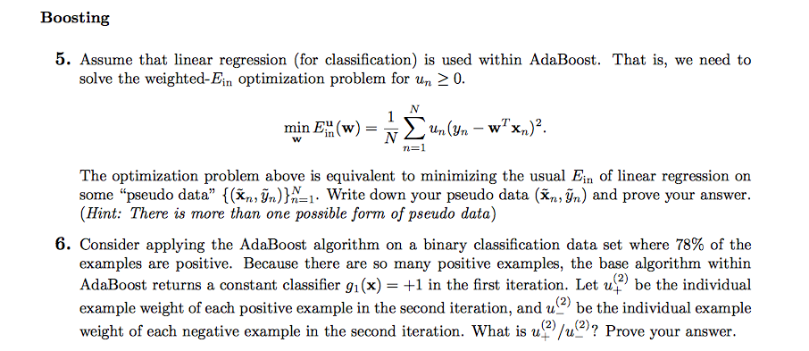
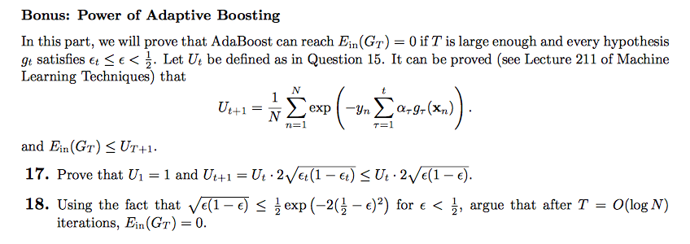

**5**

可以将$u_n​$拆成$(\sqrt{u_n})^2​$，然后合并到残差平方项中，得到：

$$RHS = \frac{1}{N}\sum_{n=1}^N \Big((y_n \sqrt{u_n})-\mathbf{w}^T(\mathbf{x}_n \sqrt{u_n})\Big)^2​$$ 

令$\tilde{\mathbf{x}}_n = \mathbf{x}_n \sqrt{u_n}$，$\tilde{y}_n = y_n \sqrt{u_n}$，即可。

**6**

易知$\epsilon_1 = 0.22$。由于第一轮学习的$g_1$：

* 将所有正类全部预测正确，因此$u_+^{(2)} = u_+^{(1)} / \Diamond_1$；
* 将所有负类全部预测错误，因此$u_-^{(2)} = u_-^{(1)} · \Diamond_1$；

故：

$$u_+^{(2)}/u_-^{(2)} = \frac{1}{\Diamond_1^2}·\frac{u_+^{(1)}}{u_-^{(1)}}= \frac{1}{\Diamond_1^2} $$

又$\Diamond_1 = \sqrt{\frac{1-\epsilon_1}{\epsilon_1}}$，代入可得结果为：$\frac{11}{39}$

**17**

$U_t$的含义是第t轮base algorithm训练时使用的样本权重，因此$U_1$就是第1轮训练时的样本权重。因为我们将样本权重初始化为1/N，因此：

$U_1 = N·\frac{1}{N} = 1$

第二个的等式证明：

$$\begin{align*}U_{t+1} & = \sum_{n=1}^N u_{n}^{(t+1)} \\ & = \sum_{n=1}^N u_{n}^{(t)} · exp(-y_n \alpha_t g_t(\mathbf{x}_n)) \\ & = \sum_{n=1}^N u_{n}^{(t)} \Big( \sum_{n=1}^N \frac{u_{n}^{(t)} · exp(-y_n \alpha_t g_t(\mathbf{x}_n))}{\sum_{n=1}^N u_{n}^{(t)}} \Big)\\ & = U_t \Big(\frac{\sum_{correct}u^{t}}{U_t}·exp(-\alpha_t)  + \frac{\sum_{incorrect}u^{t}}{U_t}·exp(\alpha_t)\Big) \\ & =U_t \Big((1-\epsilon_t)·\sqrt{\frac{\epsilon_t}{1-\epsilon_t}} + \epsilon_t·\sqrt{\frac{1-\epsilon_t}{\epsilon_t}}\Big) \\ & = U_t · 2\sqrt{\epsilon_t(1-\epsilon_t)}\end{align*}$$ 

因为函数$y = x(1-x)$在区间$[-\infty, 1/2]$上是单调递增的，又$\epsilon_t \le \epsilon < 1/2$，所以第二个的不等式被证明。

**18**

$$\begin{align*}U_{t+1} & \le U_t · 2\sqrt{\epsilon (1-\epsilon)} \\ & \le U_t · exp(-2(\frac{1}{2}-\epsilon)^2) \\ & = U_t · exp(-2\gamma^2)\end{align*}$$

因此，有$U_{t+1} \le U_t · exp(-2\gamma^2)$。迭代，得到：

$$U_{T+1} \le U_1 · exp(-2\gamma^2 T) = exp(-2\gamma^2 T)$$ 

又$E_{in}(G_T) \le U_{T+1}$，因此：

$$E_{in}(G_T) \le exp(-2\gamma^2T)$$

当回传的G在训练数据上连**一个错误都不犯**的时候，$E_{in}(G)$就等于0。我们就计算恰恰犯一个错误的时候，T的临界值；那么当T大于该临界值时，$E_{in}(G)$会小于1/N，也就是一个错都没犯了——*We can then compute the number of steps required until the loss is less than 1, which would imply that not a single training input is misclassified.*

令$exp(-2\gamma^2T) = \frac{1}{N}$，得到：

$$T = \frac{log\ N}{2\gamma^2}$$

因此，在$T = O(log N)$后，$E_{in}(G_T) = 0$。