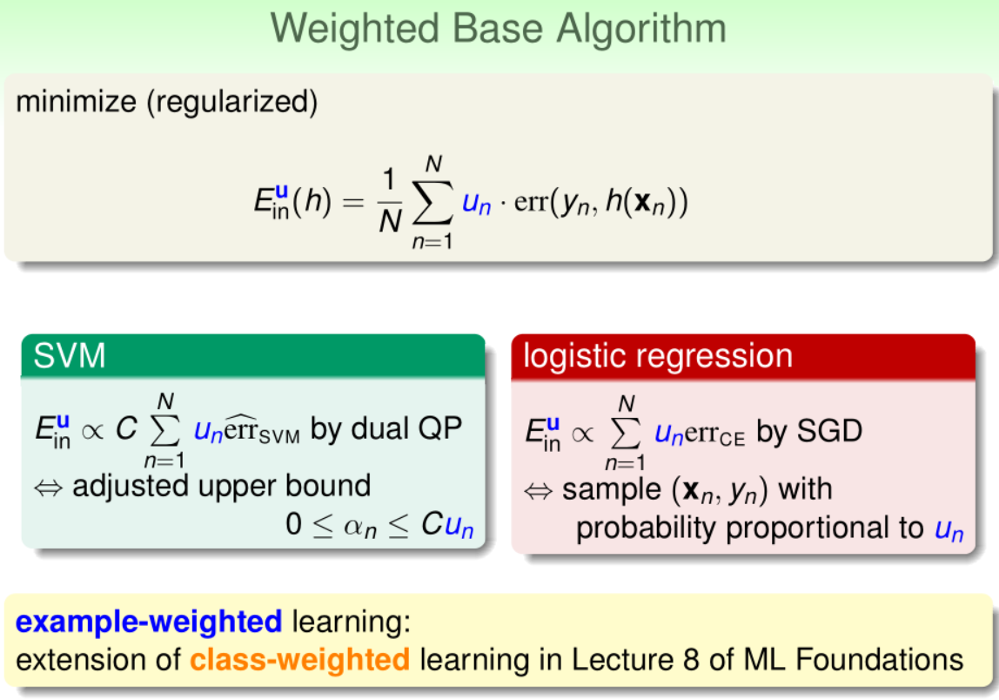
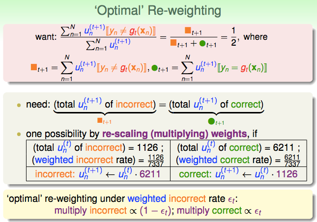
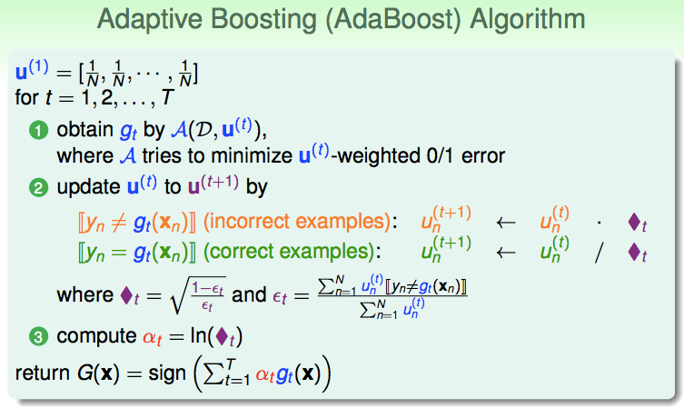
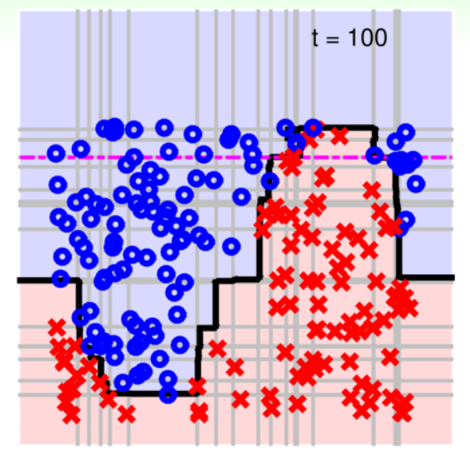

# Lecture 8: Adaptive Boosting

> 课件链接：[Hsuan-Tien Lin - adaptive boosting](https://www.csie.ntu.edu.tw/~htlin/course/ml19spring/doc/208_handout.pdf)
>
> **Adaptive Boosting(自适应增强)**
>
> * Motivation of Boosting：增强的动机(略)
> * Diversity by Re-weighting：通过重赋权重来增加多样性
> * Adaptive Boosting Algorithm：自适应增强算法
> * Adaptive Boosting in Action：AdaBoost-Stump

##1. Motivation of Boosting：增强的动机

略(建议看视频)。

## 2. Diversity by Re-weighting：通过重赋权重来增加多样性

回忆上一章最后提到的**Bootstrapping**方法——通过放回抽样的方式，从同一笔资料中，生出许多笔不同的资料。例如，原始数据集为$D = \{(\mathbf{x}_1,y_1), (\mathbf{x}_2, y_2), (\mathbf{x}_3, y_3), (\mathbf{x}_4, y_4)\}​$。假设在进行一次bootstrap后，我们得到的数据为$\tilde{D}_t = \{(\mathbf{x}_1,y_1), (\mathbf{x}_1, y_1), (\mathbf{x}_2, y_2), (\mathbf{x}_4, y_4)\}​$。对比$D​$，我们发现，这一次的重采样数据集中没有第三个样本，而第一个样本被抽到了两次。因此，我们可以将bootstrap看做**为每一个样本赋予权重的过程(re-weighting process)**：在上述重采样得到的数据集中：

* 第一笔资料被抽到两次，因此权重为2；
* 第二笔资料被抽到一次，因此权重为1；
* 第三笔资料没有被抽到，因此权重为0；
* 第四笔资料被抽到一次，因此权重为1。

如果在重采样得到的数据集$\tilde{D}_t$上进行训练，那么需要最小化假说h在其上$E_{in}$——考虑分类问题(损失函数取0-1误差)。此时，$E_{in}$可以表示为：

$$
\begin{align*}E^{0/1}_{in}(h) & = \frac{1}{4} \sum_{(\mathbf{x},y) \in \tilde{D}_t} I[y \ne h(\mathbf{x})] \\& = \frac{1}{4}\Big(I[y_1 \ne h(\mathbf{x}_1)]+I[y_1 \ne h(\mathbf{x}_1)]+I[y_2 \ne h(\mathbf{x}_2)]+I[y_4 \ne h(\mathbf{x}_4)]\Big)\end{align*}
$$
可以从"**权重**"的视角等价地改写上式：

$$
\begin{align*}E^{0/1}_{in}(h) & = \frac{1}{4}\Big(2·I[y_1 \ne h(\mathbf{x}_1)]+1·I[y_2 \ne h(\mathbf{x}_2)]+0·I[y_3 \ne h(\mathbf{x}_3)]+1·I[y_4 \ne h(\mathbf{x}_4)]\Big)\\& = \frac{1}{4} \sum_{n=1}^4 u_n^{(t)}·I[y_n \ne h(\mathbf{x}_n)]\end{align*}
$$
其中，$u_1 = 2, u_2=1, u_3=0, u_4=1$——再次体现了"权重"。因此，我们可以将bootstrap想象成为每一个样本重新赋权；基于bootstrap得到的数据集进行模型训练，则是基于"新权重"进行训练——最小化bootstrap赋权的weighted $E_{in}$。对于不同的$\mathbf{u}$，基算法(base algorithm)将返回不同的g。

从权重的视角看，Bagging算法所做的事情，是通过**随机**重赋权重以训练出许许多多不同的g，然后将它们均匀混合起来。自然我们会想，能不能**有目的**重赋权重以训练处许许多多不同的g，然后将它们按照**一定比例**混合起来？

$g_t​$与$g_{t+1}​$的表达式如下(注意，两式中仅有$\mathbf{u}​$不同)：

$$
g_t = \underset{h \in \mathcal{H}}{argmin} \Big( \sum_{n=1}^N u_n^{(t)} I[y_n \ne h(\mathcal{\mathbf{x}_n})] \Big)\\
g_{t+1} = \underset{h \in \mathcal{H}}{argmin} \Big( \sum_{n=1}^N u_n^{(t+1)} I[y_n \ne h(\mathcal{\mathbf{x}_n})] \Big)
$$
**如果$g_t​$对于$\mathbf{u^{(t+1)}}​$的数据非常差，那么根据$\mathbf{u^{(t+1)}}​$学到的$g_{t+1}​$应该和$g_t​$非常不一样。**因此，我们考虑这样构建$\mathbf{u^{(t+1)}}​$，使得$g_t​$在其上的表现与"丢铜板"的表现差不多，即错误分类的概率为1/2：
$$
\frac{\sum_{n=1}^N u_n^{(t+1)} I[y_n \ne g_t(\mathbf{x}_n)]}{\sum_{n=1}^N u_n^{(t+1)}} = \frac{1}{2}
$$
这也在暗示着，$\mathbf{u}^{(t+1)}$中上一轮犯错的样本点权重可能比较大。因为只有这样，$g_t$在其上的表现才会比较差。具体的构造方法如下：

分子(橙色方框)的含义：所有在$g_t$上犯错的点的$u^{(t+1)}$的和。分母可以拆成两个部分：

* 橙色方框：与分子一样，所有在$g_t$上犯错的点的$u^{(t+1)}$的和；
* 绿色方框：所有在$g_t$上正确的点的$u^{(t+1)}$的和；

分子与分母同时除以分子，容易看出，若让此式等于1/2，也就是要让橙色方框与绿色方框相等，即：在$g_t$上犯错的点的$u^{(t+1)}$的和与没有在$g_t$上犯错的点的$u^{(t+1)}$的和相等。

**所以，一种容易想到的调整权重的方法是**：给所有犯错点的$u^t​$乘以未犯错点的$u^t​$之和，给所有未犯错点的$u^t​$乘以犯错点$u^t​$之和(类似于交叉相乘)。抑或，可以给未犯错的点乘以**加权错误率(weighted incorrect rate)**，给犯错点乘以1减加权错误率。其中，加权错误率$\epsilon_t​$的计算为：
$$
\epsilon_t = \frac{\sum_{n=1}^N u^{t}_n\ for\ incorrect\ samples}{\sum_{n=1}^N u^{t}_n}
$$

## 3. Adaptive Boosting Algorithm：自适应增强算法

上一节推出了从$u^t$到$u^{(t+1)}$的更新规则：

1. 计算weighted incorrect rate：$\epsilon_t​$
2. 所有错误点$u^{(t+1)} = u^t · (1- \epsilon_t)​$，所有正确点$u^{(t+1)} = u^t · \epsilon_t​$

现在，我们定义一个**等价的**新的**放缩因子(scaling factor)**：$\Diamond_t = \sqrt{\frac{1-\epsilon_t}{\epsilon_t}}​$

* 对于所有错误点，我们将其权重**乘以**$\Diamond_t$；
* 对于所有正确点，我们将其权重**除以**$\Diamond_t$；

因为$g_t$是根据$u^t$学到的，因此只要是靠谱的base algorithm，$g_t$的加权错误率$\epsilon_t$都应该小于1/2，即至少比随机丢铜板要好。因此，$\Diamond_t \ge 1$。这具有实际意义：

* 对于错误点，我们将其权重乘以比1大的数，也就是放大了；
* 对于错误点，我们将其权重除以比1大的数，也就是缩小了。

**现在，我们有了一个初步的算法：**

> $u^{(1)} = [\frac{1}{N},\frac{1}{N},\cdots,\frac{1}{N}]$
>
> for $t=1,2,\cdots,T$
>
> 1. $g_t = A(D, u^{(t)})$，这里A是在最小化基于权重$u^{(t)}$的0/1误差；
> 2. 计算$g_t$的加权错误率$\epsilon_t$，然后计算$\Diamond_t$，根据规则更新得到$u^{(t+1)}$
>
> 回传$G(\mathbf{x}) =?$

此时，需要考虑用什么样的方式将得到的一个个g组合起来：

* 不能是uniform，因为$g_1$对$E_{in}$很好，但是$g_2$和$g_1$很不一样，所以$g_2$对$E_{in}$会很差；
* 可以用线性或者非线性方式；
* AdaBoost选择的方法：在生成$g_t​$时，顺便决定了$\alpha_t​$。

**改进的算法：**

> $u^{(1)} = [\frac{1}{N},\frac{1}{N},\cdots,\frac{1}{N}]$
>
> for $t=1,2,\cdots,T$
>
> 1. $g_t = A(D, u^{(t)})$，这里A是在最小化基于权重$u^{(t)}$的0/1误差；
> 2. 计算$g_t$的加权错误率$\epsilon_t$，然后计算$\Diamond_t$，根据规则更新得到$u^{(t+1)}$；
> 3. 计算$\alpha_t$；
>
> 回传$G(\mathbf{x}) =sign\Big(\sum_{t=1}^T \alpha_t g_t(\mathbf{x})\Big)$

**怎么确定$\alpha_t​$？**一种直觉是，"好的"$g_t​$应该被赋予"大的"$\alpha_t​$——好的$g_t​$，其$\epsilon_t​$应该很小，对应$\Diamond_t​$应该很大——所以$\alpha_t​$应该正比于$\Diamond_t​$：
$$
\alpha_t = ln(\Diamond_t)
$$

* 如果$\epsilon_t = \frac{1}{2}​$，则$\Diamond_t = 1​$，则$\alpha_t=0​$：丢铜板的g被赋予0票；
* 如果$\epsilon_t = 0$，则$\Diamond_t = \infty$，则$\alpha_t=\infty$：炒鸡好的g被赋予无限票。

综合上面的组合权重计算，我们得到了**Adaptive Boosting算法**：

* weak base learning algorithm A = **Student**；
* optimal re-weighting factor $\Diamond_t$ = **Teacher**；
* magic linear aggregation $\alpha_t​$ = **Class**。

**完整的AdaBoost算法：**

**基于VC维的AdaBoost的理论保证**：

$$
E_{out}(G) \le E_{in}(G) + O\Big(\sqrt{O(d_{vc}(\mathcal{H})·T\ log\ T)·\frac{log\ N}{N}}\Big)
$$

* 第一项会很小：在每次$\epsilon_t \le \epsilon \le \frac{1}{2}$时，经过$T = O(log\ N)$迭代后，就可以大概得到$E_{in}(G)=0$——这里的必要条件是：base algorithm要比"乱猜"好；
* 第二项会很小：$d_{vc}$ grows "slowly" with T。

最后，为什么叫做**Boosting(增强)**？如果A很弱，但是比乱猜好，那么通过AdaBoost算法，可以使其变得很强——$E_{in}=0$且$E_{out}$很小。

## 4. AdaBoost-Stump

通过此前论证，我们知道，AdaBoost算法最好搭配一个“弱弱的”base algorithm：①该算法能够接受带有权重信息的数据；②该算法的性能不需要太好，但要比"抛铜板"这样的乱猜法好一些——**一个不错的选择是：Decision Stump，决策树桩**：

$$
h_{s,i,\theta}(\mathbf{x}) = s · sign(x_i - \theta)
$$
三个参数：

* $s$：切分方向(direction)：哪个方向是正类；
* $i​$：切分维度(feature)：关注的是哪一个维度；
* $\theta$：切分位置(threshold)：切在哪里；

可以搜索所有三种参数的组合（因为样本是有限的，因此该组合也是有限的），得到最好的hypothesis——这也是为数不多的可以把$E_{in}$真的做到最好的hypothesis set——当然也可以做带权重的$E_{in}$！

**决策树桩的几何意义：2D上的垂直线或水平线**。

时间复杂度：$O(d·N log\ N)$

单独用Decision Stump当然不好，但是配合AdaBoost效果会很好。

## 5. Summary

* 在本章伊始，我们从"重赋权重"的角度重新审视了Bagging算法，知道Bagging实质是通过随机性的重赋权重来获得一个个不同的g然后均匀混合起来。基于此，我们受到启发，希望能够有目的、有方向地重赋权重以得到许多互补的g，然后按照一定比例混合起来。
* AdaBoost每一轮重赋权重的方法，是希望刚刚训练出的$g_t$在下一轮的新数据集$\mathbf{u}^{(t+1)}$上表现很差，这样才能保证在$\mathbf{u}^{(t+1)}$上训练出的新的$g_{t+1}$与$g_t$很不一样，互相补充。基于这种思想，我们通过一系列推导，得到了放缩因子——错误点乘，正确点除——这保证了错误点的权重在新的一轮里被放大：

$$
\Diamond_t = \sqrt{\frac{1-\epsilon_t}{\epsilon_t}}
$$

* 最后，我们希望混合系数$\alpha_t$能够反映$g_t$的好坏，因此小$\epsilon_t$，即大$\Diamond_t$的$g_t$权重应该大一些，我们取：

$$
\alpha_t = ln(\Diamond_t)
$$

* 综上，AdaBoost算法可以将弱弱的演算法效力提升，这就是Boosting——降低偏差(bias)，而上一节最后的Bagging则是降低方差(variance)。
* AdaBoost常常用决策树桩作为基算法，效果很好。