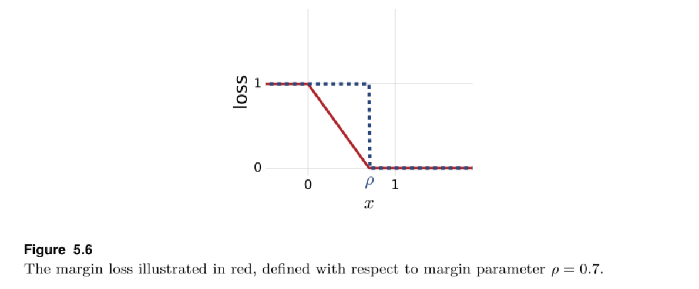

# Chapter 7: 增强方法

> Boosting

**集成方法(Ensemble methods)**是一大类机器学习算法的统称，这些算法旨在将一些预测器结合起来，创造更加强大的预测器——*Ensemble methods are general techniques in machine learning for combining several predictors to create a more accurate one*。

集成方法的一大分支是**增强方法(boosting)**，又叫做**提升方法**，其中最有名的一个算法是**自适应增强(Adaptive Boosting, 简称AdaBoost)**。

本节主要内容：

* 介绍AdaBoost算法：
	* 随着迭代轮数的增加，经验误差将快速趋近于0；
	* 与一些其他算法的联系；
* 基于VC理论与Margin Theory对AdaBoost的泛化性质进行分析；
* AdaBoost的优点与缺点。

## 一. Boosting简介

> Introduction

面对一个一般的学习任务，直接上手设计一个严格符合PAC可学习要求的强大算法是不太容易的。然而，设计一个普普通通的算法——其输出假设的表现往往只比丢铜板好那么一些（二元分类问题，丢铜板正确率是1/2），还是很容易的——例如，Decision Stump。我们将这种弱弱的算法，叫做**Weak Learner**。

下面定义**Weak Learning**：

概念类C是**弱PAC可学习的**，当且仅当存在一个弱的学习算法L和$\gamma > 0$，满足：对于所有$\delta > 0$，所有$c \in C$，所有分布D，当样本集S的大小$m \ge poly(1/\delta)$，有：

$$\underset{S \sim D}{Pr}\Big[R(h_S) \le \frac{1}{2} - \gamma\Big] \ge 1- \delta$$

这里的算法L就是一个**Weak Learner**；L回传的假说被称为**Base classifier**。

之前严格的PAC可学习要求$R(h_S)$小于等于任意的$\epsilon$，但这里只需要小于等于一个确定的略小于1/2的数即可——也就是比丢铜板好一些些。

**Boosting的核心思想**：基于弱学习算法构建强学习算法——*use a weak learning algorithm to build a strong learner , that is, an accurate PAC-learning algorithm*；具体而言，将不同的base classifiers结合起来，创造一个精确的预测器。这就带来**两个问题**：

* 用哪种弱学习算法？
* 怎样结合base classifiers？

## 二. AdaBoost

pseudocode of AdaBoost：

【以二元分类问题为例】

* $D_t​$：第t轮训练弱预测器时使用的样本权重；
* $h_t$：第t轮训练出的弱预测器；
* $\epsilon_t$：第t轮训练出的弱预测器的加权错误率，等价于$\sum_{incorrect}D_t(i)$，其实还有分母1，因为权重被标准化了，所以可以不写；
* $\alpha_t$：第t轮训练出的弱预测器的系数；
* $Z_t$：从$D_t$到$D_{t+1}$更新权重时的标准化系数。

关于$D_t$：训练样本上的一个分布，表示每个样本的权重，角标t表示第t轮迭代(t th round)时的分布。每一轮(假设第t轮)，弱算法都会基于带有$D_t$权重的样本，训练一个新的弱预测器$h_t$，方法是最小化加权的$E_{in}^t$（预测错误的样本点的权重之和；由于所以样本的权重之和是规范化的，即为1，因此也是预测器的加权错误率$\epsilon_t$）：

训练完毕后，需要更新这个分布到$D_{t+1}$：简单来说，预测正确的点的权重变小，错误的点权重变大；还有分母的$Z_t$是归一化系数，保证权重之和为1。

还要顺便计算该弱预测器的权重$\alpha_t$：直接取决于该预测器的加权错误率$\epsilon_t$，加权错误率越低，则权重越大；加权错误率越高，则权重越低。

我们将第t轮后所有base classifiers的线性组合记作：

$$f_t = \sum_{s=1}^t \alpha_sh_s$$

则有(迭代法很容易证明)：

$$\forall i \in [m]，D_{t+1}(i) = \frac{e^{-y_if_t(x_i)}}{m \prod_{s=1}^t Z_s}$$

### 1. 经验误差的边界

> Bound on the empirical error

**AdaBoost的经验误差随着迭代轮数的增加呈指数减少**——*empirical error of AdaBoost decreases exponentially fast as a function of the number of rounds of boosting*。

在证明中，我们推出：

$$\hat{R}_S(f) \le \prod_{t=1}^T Z_t$$

而$Z_t​$可以被写为：

$$Z_t = (1-\epsilon_t)e^{-\alpha_t} + \epsilon_te^{\alpha_t}$$

将$Z_t$看成$Z_t(\alpha_t)$，最小化它，得到：

$$\alpha_t = \frac{1}{2} ln(\sqrt{\frac{1-\epsilon_t}{\epsilon_t}})​$$

因此，我们可以将每一步的alpha系数的选择，看做是在为最小化最终集成的预测器的经验误差而努力——these coecients are selected to minimize an upper bound on the empirical error。

此外，需要注意到，分布（权重）更新完毕后，正确点的权重之和 = 错误点的权重和——但是由于弱分类器再垃圾，其正确率也大于一半，因此错误点交正确点少，所以错误点的权重还是较大的。

### 2. 与坐标下降法的联系

> Relationship with coordinate descent

推导暂略，结论如下。

**AdaBoost等价于采用坐标下降法最优化下面的可微凸函数：**

其中，我们假设base classifier set $\mathcal{H}$是包含N个假说的有限集合，那么我们就可以把任何一个结合而成的预测器记作$f = \sum_{j=1}^N \overline{\alpha_j} h_j$，其中系数是大于等于0的。

坐标下降法：

* 方向 = base classifier with smallest error，即AdaBoost每一轮的最小化；
* 步长 = base classifier weight of AdaBoost，即AdaBoost为每一个base classifier赋予的线性系数。

**因此，对上述F使用坐标下降法进行优化，完全等价于AdaBoost**——*Thus, coordinate descent applied to exponential objective F precisely coincides with AdaBoost and F can be viewed as the objective function that AdaBoost seeks to minimize.*

所以，$e^{-x}$又被称为boosting loss。

### 3. 实践

Base learners常常使用depth不深的决策树（depth=2,3,4……）；特别的，决策树桩常常配合AdaBoost使用，构成AdaBoost-Stump算法。

## 三. 理论保证

> Theoretical results

### 1. 基于VC维的分析

> VC-dimension-based analysis

首先，我们将写出AdaBoost的假说集合。容易知道，当迭代轮数越大的时候，我们可以选到的集成模型越复杂。因此，AdaBoost的假说集合应该是迭代轮数T的函数：

假设base classifier set的VC维是d，已经被证明，$\mathcal{F}_T$的VC维可以被下式bound住：

$$VCdim(\mathcal{F}_T) \le 2(d+1)(T+1)log_2((T+1)e)​$$

**上式说明，理论上当迭代轮数过多时，AdaBoost的确可能过拟合。但现实中，往往不会过拟合——当训练误差达到0以后，随着迭代轮数的增加，测试误差竟然还能继续下降！**

下面基于margin的分析能够解释上面的实际观察结果。

### 2. L1几何间隔

> L1-geometric margin

Margin，间隔。

**回忆SVM中对函数间隔和几何间隔的定义(李航，统计学习方法)：**

* **函数间隔**：超平面$\mathbf{w}$（这里把b写进去了）关于样本点$(z,y)$的函数间隔为：

$$y(\mathbf{w}·\mathbf{z})​$$

关于数据集S的函数间隔为关于S中所有样本点函数间隔的最小值：

$$\underset{i=1,\cdots,N}{min} y_i(\mathbf{w}·\mathbf{z_i})$$ 

* **几何间隔**：超平面$\mathbf{w}$（这里把b写进去了）关于样本点$(z,y)$的几何间隔为：

$$\frac{y(\mathbf{w}·\mathbf{z})}{||\mathbf{w}||_2 }$$

关于数据集S的几何间隔为关于S中所有样本点几何间隔的最小值：

$$\underset{i=1,\cdots,N}{min}  \frac{y_i(\mathbf{w}·\mathbf{z_i})}{||\mathbf{w}||_2 }$$

对某个样本点的**函数间隔**与**几何间隔**能够反映该预测器对于该点分类的**①正确性**与**②确信度**；对整个数据集的**函数间隔**与**几何间隔**能够反映该预测器对于整个数据集的分类正确性和确信度。但在做选择的时候，不能依靠函数间隔。因为成比例地改变$\mathbf{w}$，预测器实质没有变化，但函数间隔却也成比例改变。因此，可以对$\mathbf{w}$规范化，这样就得到了几何间隔。**SVM就是在最小化预测器对训练数据集的几何间隔**。

本书的SVM中，作者提出的是**confidence margin**的概念（实质就是函数间隔，只不过将f(x)=wx推广到了所有f(x)）——下面内容摘自第5章最后一节，Margin Theory：

 > 作者提出confidence margin——The confidence margin of a real-valued function h at a point x labeled with y is the quantity yh(x)。需要注意的一点是，这里的h(x)是不加sgn运算的。在分类问题中，如果yh(x) > 0，则说明h对该点的预测正确，且改值越大，则说明置信度越高（离分离平面越远）。
> 
> 基于confidence margin的概念，作者提出了一个新的损失函数，**ρ-margin loss function**，该损失函数有一个参数ρ。我们知道，0-1损失函数是对于yh(x) < 0的样本给予1的惩罚，而ρ-margin损失函数是对于yh(x) < ρ的样本给予相应的惩罚（一些样本点虽然被分类正确了，但是置信度不高，也要惩罚），具体的Margin Loss Function如下：
> 
> 
> 
> 例如，ρ = 0.7的损失函数和0-1损失函数对比，可以看出，0-1是其上界：
> 
> 
> 
> 下面，作者定义了一个假说h在数据集S上的关于ρ的empirical margin loss：
> 
> 
> 
> 我们更常使用的其上界，可以这样解释： it is the fraction of the points in the training sample S that have been misclassified or classified with confidence less than ρ——这些点的数量。
> 
> 通过引入margin loss，我们可以得到margin-based generalization bound（下面是二元分类问题的）：
> 
> 
> 
> 可以Stop了。

这里，作者针对由一系列h线性组合而成的f(x)，也就是AdaBoost回传的集成假说(ensemble hypotheses returned by AdaBoost)，提出其几何间隔的概念。记法：集成假说为$f = \sum_{t=1}^T \alpha_t h_t​$，可以写成向量形式$f = \mathbf{\alpha} · \mathbf{h}​$：

（主要不同就在范数类型上，这里用的是L1范数，所以叫**L1几何间隔**）

我们把AdaBoost回传的函数f的规范化版本(normalized version of the function f returned by AdaBoost)记作：

$$\overline{f} = \frac{f}{\sum_{t=1}^T \alpha_t} = \frac{f}{||\mathbf{\alpha}||_1}​$$

注意到，如果一个样本(x,y)被$f​$正确分类，那么说明也能被$\overline{f}​$正确分类，且$\overline{f}​$在其上的L1 confidence margin为：

$$y\overline{f}(x) = \frac{yf(x)}{||\alpha||_1} = \rho_f(x)$$

也就是f关于样本(x,y)的L1几何间隔。 

### 3. 基于间隔的分析

 > Margin-based analysis

首先，我们简单分析一下convex linear ensembles的拉德马赫尔复杂度。对于任何一个假说集合$\mathcal{H}$，我们将其凸锥集合(convex hull)记作$conv(\mathcal{H})$：

$$conv(\mathcal{H}) = \Big\{\sum_{k=1}^p \mu_k h_k: p \ge 1, \forall k \in [p], \mu_k \ge 0, h_k \in \mathcal{H}, \sum_{k=1}^p \mu_k \le 1   \Big\}​$$

下面的引理说明，conv(H)的经验拉德马赫尔复杂度等于H的经验拉德马赫尔复杂度，即使前者严格地比后者更大：

结合本书SVM部分的理论(theorem 5.8)，基于拉德马赫尔复杂度，我们可以直接获得**凸锥集合中任意凸组合**的泛化上界（这里用上面的引理将RHS的第二项替换成了H的复杂度）：

**其中$\hat{R}_{S,\rho}(h)$是empirical margin loss with margin $\rho$。**

因为拉德马赫尔复杂度又能被VC维限制住，因此，我们可以得到如下的基于VC维的泛化上界：

注意，上述两类泛化边界，并不能直接用在AdaBoost回传的集成假说f上，因为f并不是凸锥组合（组合系数之和并不小于1），但是可以用在其规范化版本$\overline{f}​$上。由于f和$\overline{f}​$是等价的，因此两者的泛化误差相同。因此有：

可见，上述边界只取决于：

* confidence margin $\rho$；
* the sample size m, the Rademacher；
* complexity of the family of base classifiers H。

因此，如果上面不等式右侧的第一项——$\overline{f}$的margin loss，能够对于$\rho$较大时（第二项很小），也很小，那么f的泛化误差就有了保证。根据之前（还是第5章）的推导，我们知道，margin loss可以被一部分样本bound住——这些样本的confidence margin最大为$\rho$，即满足下式的样本：

$$y \overline{f}(x) \le \rho \Leftrightarrow \frac{yf(x)}{||\alpha||_1} \le \rho$$

但是，作者接下来给出了另一个与迭代轮数T有关的bound——**decreases with T under conditions discussed later**。

基于上面的定理，引进edge value $\gamma​$之后，margin loss的上界又可以写成：

在实践中，$\epsilon_t$会是关于t的增函数，是因为，随着迭代的进行，弱分类器不得不去面对那些很难分类的点——*the weak learner to concentrate on instances that are harder and harder to classify, for which even the best base classifier could not achieve an error significantly better than random*。如果$\epsilon_t$很快就逼近$1/2$，那么定理7.7的bound就hold不住了。

综上分析，**如果AdaBoost有一个正的edge value $\gamma$**，那么对于任意$\rho < \gamma$，当T最够大时，f泛化误差的第一项$\hat{R}_{S,\rho}(\overline{f})$会趋近于0（不需要很大的T，因为是指数型逼近，很快）——此时，AdaBoost的输出函数（当然是不包括sgn运算的）在训练数据上的L1几何间隔无限逼近于$\gamma$。

**因此，AdaBoost有一个Weaking Learning Condition，就是必须存在一个正的edge value**：

**直接给出，当且仅当训练集线性可分的时候，$\gamma$大于0*。

现在可以尝试解释，为什么在某些任务中，训练误差已经达到0，泛化误差还会继续减小——the geometric margin continues to increase when the training sample is separable——当训练样本是线性可分的时候，虽然训练误差已经达到0，可以AdaBoost还在继续调整预测器，使其几何间隔不断增大（有点类似SVM，不仅要训练误差是0的，还要更加robust的）。

最后，AdaBoost是在最大化f的L1几何间隔吗？并不是，只是在收敛。

### 4. 最大化间隔

> Margin maximization

略。

### 5. Game-theoretic interpretation

略。

## 四. L1-regularization

在实践中， 训练样本往往不是线性可分的，这样AdaBoost就没有一个正的edge value，弱学习条件就不能得到满足，泛化边界就不成立；或者，有一个正的edge value，但是很小很小——这是由于样本中有一些非常不好分类的点，“破坏”了好的线性可分状态。这种情况下，AdaBoost的回传假说中，一些base classifier的权重会很大——这是由于，那些很难分类的点的权重会随着迭代次数的不断增多而增大；而即使这样只有一些base classifier能够预测好它们，然后AdaBoost会不断选择这些base classifier，导致其alpha很大，导致最后回传的f的预测，其实就是它们几个的“寡头”——只听几个分类器的决策。

**解决方案**

1. 限制总迭代次数T——limiting the number of rounds of boosting T, which is also known as **early-stopping**
2. 控制alpha系数的大小—— controlling the magnitude of the mixture weights——就是普通的正则化，L1形式如下：

## 五. Discussion

AdaBoost的优点：

* 简单：直观易执行；
* 有效率：AdaBoost-Stump的时间复杂度是O(mNT)，N和T不是很大的时候，算法很快；
* 有理论保证：但仍然有问题，比如AdaBoost并没有在最大化margin，但是它可能比最大化margin的算法更好

小缺点：

* 参数T需要决定：我们知道T如果太大，可能导致过拟合；实务中往往是由CV来确定T；
* base classifier需要确定：所有和AdaBoost有关的bound，里面都含有base classifier set的复杂度。

**大缺点：**

* **在有噪声的情况下的性能不好——对异常值敏感**；
* The distribution weight assigned to examples that are harder to classify substantially increases with the number of rounds of boosting, by the nature of the algorithm——那些难以分类的样本的权重会随着迭代轮数的增加而显著增加；
* 然后这些样本将会主导后期对于base classifier的选择，那么由其集成得到的最终预测器性能会大打折扣；

改进的方法：

* 将指数型的损失函数改为不那么“剧烈的”，对错误分类样本惩罚没有那么狠的损失函数，如logistic loss；
* 正则化：L1-regularized AdaBoost。

**均匀噪声（uniform noise）会严重影响AdaBoost的性能。**

但是，我们可以利用**AdaBoost敏感于噪声**这个特点，进行**异常值检测**：①incorrectly labeled sample；②hard to classify sample；**经过多轮后，权重非常大的样本可以认为是异常值**——*Examples with large weights after a certain number of rounds of boosting can be identified as outliers.*

其他增强方法：

* DeepBoost；
* L1-regularized AdaBoost；
* arc-gv