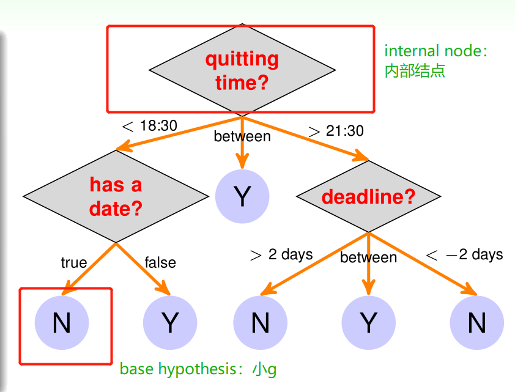
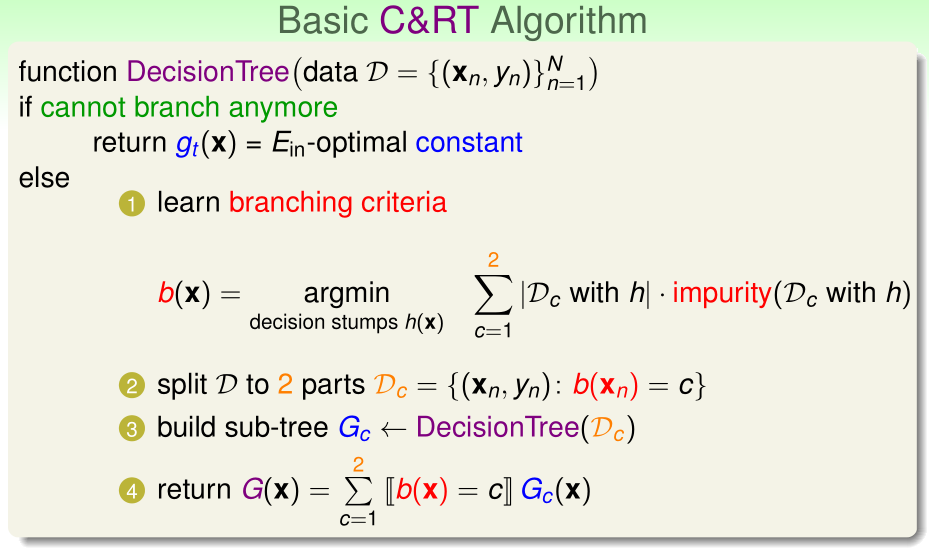
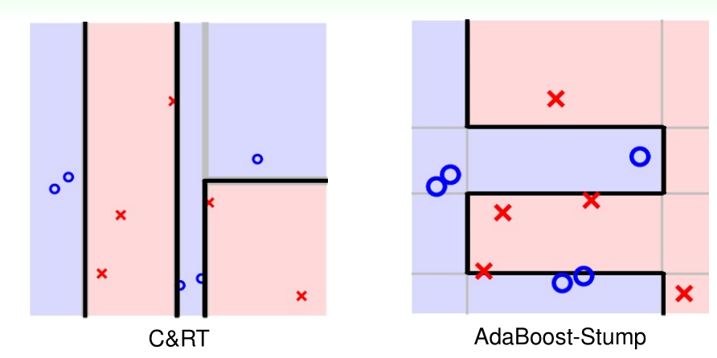
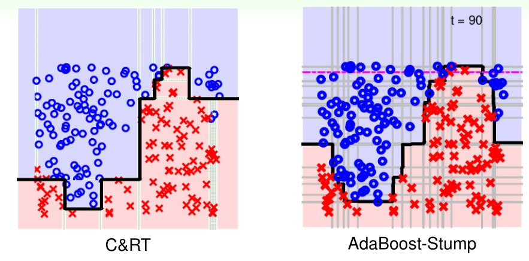

# Lecture 9: Decision Tree

> 课件链接：[Hsuan-Tien Lin - decision tree](https://www.csie.ntu.edu.tw/~htlin/course/ml19spring/doc/209_handout.pdf)
>
> **Decision Tree(决策树)**
>
> * Decision Tree Hypothesis：决策树假说的形式
> * Decision Tree Algorithm：决策树算法
> * Decision Tree Heuristics in C&RT：C&RT算法的巧思
> * Decision Tree in Action：决策树的实际应用

## 1. Decision Tree Hypothesis：决策树假说的形式

Aggregating Model可以分为Blending与Learning两大类：Blending是指在已经拥有一些预测器$g_t$的前提下，通过某种方式将它们组合起来，即aggregate after getting $g_t$；Learning是指一边学习新的预测器$g_t$，一边通过某种方式将它们组合起来，即aggregate as well as getting $g_t$，例如上一章介绍的AdaBoost。

在Blending和Learning下，还可根据不同的**组合方式**进行分类：

> **Blending**
>
> * Uniform：一人一票(voting)，或者简单平均(averaging)；
> * Non-uniform：例如，线性组合。若此，如何确定每个预测器的权重系数？一种可行的方法是：将每个预测器当作transformation，对原始数据$\mathbf{x}$进行转换$\Big(g_1(\mathbf{x}), g_2(\mathbf{x}), \cdots, g_T(\mathbf{x})\Big)$，然后用转换后的数据对y进行线性回归，得到每个预测器的权重系数；
> * Conditional：又称为堆叠(stacking)，与线性组合类似，也可以看做对原始数据进行转换，但差别在于并不是用线性回归，而是用非线性模型进行拟合。
>
> **Learning**
>
> - Uniform：即Bagging，用Bootstrapping的方式每一轮得到一笔新的资料，训练一个新的$g_t$，最终把所有g平均起来，得到G；
> - Non-uniform：例如AdaBoost，每一轮用带权重的样本训练一个新的$g_t$，并确定其权重系数，最终把所有g根据各自的权重系数线性组合起来，得到G；
> - **Conditional：Decision Tree！**

决策树具有非常悠久的历史，因为它的决策过程与人类做决策的过程十分类似。下面是一棵十分简单的决策树，它可以根据我们的输入来输出我们是否会看线上课程。例如，输入为(22:30, 10)，则输出为N——因为qutting time是22:30，大于21:30，所以走第一层最右边的路径，来到dealine的判断；因为10大于2，所以走最左边的路，得到N。

理解决策树的两种视角——路径视角与递归视角。

* **Path View：路径视角**

因为决策树是Conditional Learning，所以hypothesis可以写成如下形式：

$$
G(\mathbf{x})=\sum^T_{t=1}q_t(\mathbf{x})·g_t(\mathbf{x})
$$
通过与上图进行对比，我们发现：base hypothesis $g_t(\mathbf{x})$是一个个叶节点，而condition $q_t(\mathbf{x})$表示$\mathbf{x}$是否在t路径上，即$I(\mathbf{x}\ on\ path\ t)$。因此，从路径的视角，我们可以将决策树hypothesis写成：

$$
G(\mathbf{x})=\sum^T_{t=1}I(\mathbf{x}\ on\ path\ t)·leaf_t(\mathbf{x})
$$
因为一个$\mathbf{x}$只可能"属于"某一条路径，因此求和项中T个0-1函数只有一个是1，其余是0。所以，最终G返回的就是此$\mathbf{x}$所在路径的叶节点上的结果。

* **Recursive View：递归视角**

假设某决策树从根部开始有C条分支(branch)，那么我们可以将整个决策树表示为C个不同"状况"下的C棵"小决策树"的组合，即：

$$
G(\mathbf{x})=\sum^C_{c=1}I\Big(b(\mathbf{x})=c\Big)·G_c(\mathbf{x})
$$
其中：$b(\mathbf{x})$：分支决策条件，branching criteria；$G_c(\mathbf{x})$：c-枝子树，sub-tree hypothesis at the c-th branch。同样，一个$\mathbf{x}$只会属于某一个分支，所以0-1函数只有一个是1，其余是0。

**决策树的优点和缺点**

* 优点：
  * 解释性好：因为和人类做决策的过程类似；
  * 简单；
  * 有效率；
* 缺点：
  * 缺乏理论保证；
  * 有很多”拍脑袋的巧思“；
  * 没有一个非常有代表性的演算法。

## 2. Decision Tree Algorithm：决策树算法

根据决策树的递归写法：

$$
G(\mathbf{x})=\sum^C_{c=1}I\Big[b(\mathbf{x})=c\Big]·G_c(\mathbf{x})
$$
我们可以写出这样一个构建一棵决策树的算法：

> **funtion DecisionTree(data $D = \{(\mathbf{x}_n, y_n)\}_{n=1}^N$)：**
>
> if termination criteria met
>
> * return base hypothesis $g_t(\mathbf{x})$
>
> else
>
> * learning branching criteria $b(\mathbf{x})$——学习如何做分支；
> * split D to C parts $D_c = \{(\mathbf{x}_n, y_n): b(\mathbf{x}_n) = c\}$——根据分支条件将数据分成C份；
> * build sub-tree $G_c$ ← DecisionTree($D_c$)——用每份数据学一棵小小的树；
> * return $G(\mathbf{x})=\sum^C_{c=1}I\Big[b(\mathbf{x})=c\Big]·G_c(\mathbf{x})$。

可以看到，在上述概括性的决策树算法中，有**四个选择**需要具体考虑：

1. number of branches：分支数量；
2. branching criteria：如何做分支；
3. termination criteria：停止条件；
4. base hypothesis：小g。

**Classification and Regression Tree——CART演算法**

* **C=2**，即每次只切一刀，将资料一分为二——**Binary Tree**，二叉树；
* $g_t(\mathbf{x}) = E_{in}\ optimal\ constant$
  * 分类问题，0-1误差，则返回叶节点资料中的“大多类”，即majority of {$y_n$}；
  * 回归问题，平方误差，则返回叶节点资料的平均值，即average of {$y_n$}；
* 使用decision stump，即决策树桩进行切分——选择某一个特征与一个切分点，将资料分成两份。怎样决定stump的切分特征和切分点？用**purifying**的概念——“越切越纯”
  * $b(\mathbf{x}) = \underset{decision\ stump\ h(\mathbf{x})}{argmin} \sum_{c=1}^{2} |D_c\ with\ h|· impurity(D_c\ with\ h)$
  * Impurity Function：度量数据集合的纯度
    * 用回归误差：$impurity(D) = \frac{1}{N}\sum_{n=1}^N (y_n - \overline{y})^2$ 
    * 用分类误差：$impurity(D) = \frac{1}{N}\sum_{n=1}^N I\Big[y_n \ne y^* \Big]$
    * 用Gini系数(对分类问题)：$impurity(D) = gini\ index = 1 - \sum_{k=1}^K \Big(\frac{\sum_{n=1}^N I\Big[y_n = k\Big]}{N}\Big)^2$
  * **CART中，对回归问题用回归误差，对分类问题用Gini系数**。
* 停止条件：
  * 被迫停止的状况：这样的决策树称为**完全长成树(fully-grown tree)**
    * ①数据中所有的$y_n$都一样，那么不纯度为0，那么就返回$g_t(\mathbf{x}) = y_n$；
    * ②数据中所有的$\mathbf{x}_n$都一样，那么就没办法生成stump；

综上，CART演算法构造的决策树，是**fully-grown tree with constant leaves that come from bi-branching by purifying**。

## 3. Decision Tree Heuristics in C&RT：C&RT算法的巧思

CART演算法：

可见，CART演算法可以轻松处理**二元分类**、**回归**、**多元分类**问题，且十分简单。

**决策树的正则化与CART的选择**

在$\mathbf{x}_n$各不相同的情况下，完全长成树能够使$E_{in}(G) = 0$——这样的树太复杂了，很容易过拟合；并且，随着切分的不断深入，每一个内部结点上的资料量会变少，因此在那些结点上的拟合很可能是过拟合的。

因此，需要正则项。例如，我们可以选择**叶结点数量**为惩罚的正则项，即$\Omega(G) = NumberOfLeaves(G)$：

$$\underset{all\ possible\ G}{argmin}\ E_{in}(G)+\lambda \Omega(G)$$

上面的最优化说明，我们想要的树，经验误差可能有一些大，但是复杂度比较小，这样的树叫做**pruned decision tree**。但上面的最优化问题在实际中无法做到，因为我们不能得到所有的G。所以，我们可以这样做：

* 先得到完全长成树$G^{(0)}$；
* 然后分别将其每一个叶结点(准确来说，是兄弟结点也是叶结点的叶结点)去掉(实质是和兄弟叶结点合并，重新再计算g)，得到一连串新的少一个叶结点的决策树，从中选出$E_{in}$最小的那一个，作为$G^{(1)}$；
* 同样的对$G^{(1)}$如此操作，得到$G^{(2)}$；
* ……
* 然后将$G^{(0)},G^{(1)},G^{(2)}\cdots$作为all possible G，进行上述最优化问题。
* $\lambda$的选择用validation。

**CART决策树处理分类变量**

此前我们考虑的都是数值变量(numerical features)，决策树在一个内部结点用decision stump学习某特征的一个门槛值，大于去一边，小于去另一边：

$$
b(\mathbf{x}) = I\Big[x_i \le \theta\Big] + 1,\quad \theta \in \R
$$
但是对于分类变量(categorical features)，用阈值则没有意义，因此不应该使用decision stump——使用**decision subset**：

$$
b(\mathbf{x}) = I\Big[x_i \in S \Big] + 1,\quad S \subset \{1,2,\cdots, K\}
$$
因此，CART演算法能够轻松处理分类变量。

**CART决策树对缺失值的处理**

例如，在训练的时候，某一个分支是$b(\mathbf{x}) = I\Big[weight \le 50k g\Big]$。但是，在预测一笔数据的时候，发现weight数据缺失，一种可能的做法是，用另一个特征去做该分支的判断：例如，体重50kg以下的人，大概是身高155cm以下的人，因此我们用身高及155这个阈值来做该分支的判断——**替代的切分**——CART在训练的时候，会针对每个内部结点，**在找到最佳切分的同时，储备一系列替代切分**，以防在预测时遇到缺失值：main surrogate branch $b_1(\mathbf{x}), b_2(\mathbf{x}), \cdots, \approx\ best\ branch\ b(\mathbf{x})$。怎么找替代切分？替代切分与最佳切分切出来的部分是类似的。

因此，CART演算法能够轻松处理预测时遭遇缺失值的问题。

## 4. Decision Tree in Action：决策树的实际应用

**CART的决策树**与**AdaBoost的集成假说**的对比：CART切的垂直刀和水平刀很多并不是横跨整个平面的，因为一些刀是在有条件的状况下切的；而AdaBoost的每一个Stump都横跨整个平面。

另一个比较有名的决策树构建演算法：**C4.5**

## 5. Summary

* 决策树模型是Conditional Learning，其hypothesis可以从Path视角和Recursive视角理解。
* 构建决策树的算法大致要考虑4件事情：第一，每个内部结点构建几条分支；第二，如何构建每条分支；第三，何时停止；第四，叶节点回传的小g怎么决定。
* **CART**是常用的一种演算法，对于上述问题的回答是：第一，每个内部结点构建2条分支；第二，用决策树桩将数据一分为二，切分的依据是加权不纯度最低，分类问题用Gini系数，回归问题用平方误差；第三，完全长成停止(最后需要剪枝)，包括两种情况——所有的x一样或所有的y一样；第四，选择经验误差最小的常数g——分类问题为最多数的类别，回归问题为平均数。
* CART剪枝，防止过拟合。
* CART对分类变量的处理：用decision subset替换decision stump；对缺失值的处理，训练时保留surrogate branch。

