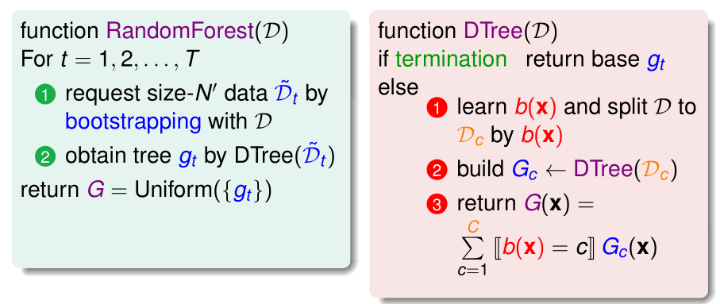
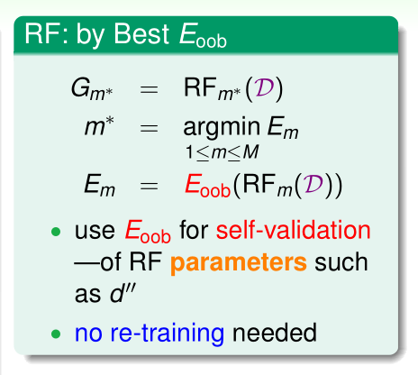

# Lecture 10: Random Forest

> 课件链接：[Hsuan-Tien Lin - random forest](https://www.csie.ntu.edu.tw/~htlin/course/ml19spring/doc/210_handout.pdf)
>
> **Random Forest(随机森林)**
>
> * Random Forest Algorithm：随机森林算法
> * Out-Of-Bag Estimate：基于袋外样本的估计
> * Feature Selection：特征选择
> * Random Forest in Action：随机森林的实际应用

## 1. Random Forest Algorithm：随机森林算法

第7章最后介绍的Bagging演算法能够提取基演算法的“共识(consensus)”，降低基演算法回传假说的方差(Variance)。而上一章介绍决策树，其构建算法往往十分不稳定，回传的假说Variance往往较大——只要资料有一点点不一样，切分的选择可能就会发生变化。总之：

* Bagging：**Reduces variance** by voting or averaging；
* Decision tree：**Large variance** especially if fully-grown。

将Bagging与DT结合起来，效果会很好——Aggregation of aggregation，用Bagging将一堆决策树合起来。

**Random Forest = Bagging + fully-grown CART decision tree**

RF的优点：

* Bagging部分可以**并行计算**，DT的训练又很有效率；
* 继承了DT的所有优点；
* 完全长成树容易过拟合，但Bagging可以弥补这一缺点。

**RF中增添了一些“巧思”来帮助多样化g，即每一棵决策树**

RF已经用到的多样化g的方法是Bootstrapping，即从资料端添加randomness。RF另外采用随机选择“**部分特征**”的方式，训练一棵棵决策树，来增加这些小树的多样性。例如，这一棵树用1、3、7特征来训练，那棵树用2、4、7特征来训练，这样得到的树一定很不一样：

* 原来：randomly sample $N'$ examples from D
* 现在增加：randomly sample $d'$ features from $\mathbf{x}$

可以将这种“随机选择部分特征”，看做是一种transform——原来是d维，现在是$d'$维，是原来特征空间的一个**random subspace**：
$$
\Phi(\mathbf{x}) = (x_{i_1}, x_{i_2}, \cdots, x_{i_{d'}})
$$
通常$d' << d$。实践中，RF在每一次决定分支$b(\mathbf{x})$时都进行了这一步。

因此，RF = bagging + random-subspace CART。

**然而，RF对于random subspace做了更进一步的扩展。**

之前我们提到，可以将random subspace看做是一种transform。更具体的，是$\Phi(\mathbf{x}) = P·\mathbf{x}​$，其中**投影矩阵P**是一个随机的$d' × d​$矩阵，其行是**单位向量**。例如，原始特征数量为5，random subspace特征数量为3——取第1、2、4个特征：
$$
\begin{bmatrix}
1 & 0 & 0 & 0 & 0 \\
0 & 1 & 0 & 0 & 0 \\
0 & 0 & 0 & 1 & 0 \\
\end{bmatrix}

\begin{bmatrix}x_1\\x_2\\x_3\\x_4\\x_5\\\end{bmatrix}

= \begin{bmatrix}x_1\\x_2\\x_4\end{bmatrix}
$$
RF认为，可以将投影矩阵的行从单位向量$\mathbf{e}$换成任意向量$\mathbf{p}$，这样$\mathbf{p}^T \mathbf{x}$就不再是某一个维度的值，而是某几个维度的线性组合——原来是投影到某个维度，现在是投影到任意方向：
$$
\begin{bmatrix}1 & 2 & 0 & 0 & 0 \\0 & 2 & 3 & 0 & 0 \\0 & 0 & 0 & 1 & 5 \\\end{bmatrix}\begin{bmatrix}x_1\\x_2\\x_3\\x_4\\x_5\\\end{bmatrix}= \begin{bmatrix}x_1+2x_2\\2x_2+3x_3\\x_4+5x_5\end{bmatrix}
$$

通常，RF考虑的是low-dimensional projection，即$\mathbf{p}$中大多还是0，只有少数几个值非0。同样，RF在每一次决定分支$b(\mathbf{x})$时都进行了这一步。

因此，RF = bagging + random-combination CART。

## 2. Out-Of-Bag Estimate：基于袋外样本的估计

第t列中打星号的资料，就是在训练$g_t$时没有用到的资料，被称为**out-of-bag examples of $g_t$，简称OOB资料**。例如，在训练$g_1$时，Bootstrapping抽到了第1笔、第N笔等资料，但是像第2笔、第3笔资料就没有用到。

**每次Bootstrapping时OOB资料的数量计算**

OOB资料，实质是进行$N’$次有放回抽样后一次都没有被抽到的资料。假设$N=N'$，某一笔资料，$N'$有放回没有抽到一次的概率为（N很大）：
$$
(1-\frac{1}{N})^N = \frac{1}{(\frac{N}{N-1})^N} = \frac{1}{(1+\frac{1}{N-1})^N} \approx \frac{1}{e}
$$
从N笔资料中有放回抽样N次，每笔资料一次都没有被抽到的概率是1/e。因此，每训练一个g，大概就有$\frac{1}{e}N$笔OOB资料。

因为OOB资料没有参与训练g，因此可以作为**验证资料**。然而，我们并不需要验证$g_t$，而是想去验证G。设计这一一种留一验证法(leave-one-out cross validation)：

* 构建$G_n^-$：$G_n^-$是所有没有用$(\mathbf{x}_n,y_n)$训练的g的Uniform组合。例如：$G_N^- = average(g_3,g_T)$；
* 这样的话，$(\mathbf{x}_n,y_n)​$这一笔资料就可以作为$G_n^-​$的验证资料，有点类似Leave-one-out validation；
* $E_{oob}(G) = \frac{1}{N} \sum_{n=1}^N err\Big(y_n, G_n^-(\mathbf{x_n})\Big)​$；
* 因此，在训练完一个RF后，其Validation Error也能够顺便得到，而不需要再划出一个验证集——**Self-Validation**。

因此，在做参数选择的时候，我们可以直接比较OOB误差。

## 3. Feature Selection：特征选择

**特征选择问题。**

对于$\mathbf{x} = (x_1, x_2, \cdots, x_d)$，当d十分巨大（几万）时，我们往往希望删掉某些特征：

* **冗余特征**(redundant features)：例如“年龄”和“生日”，保留一个即可；
* **不相关特征**(irrelevant features)。

得到$\Phi(\mathbf{x}) = (x_{i_1}, x_{i_2}, \cdots, x_{i_{d'}})​$，其中$d' << d​$——可以看做是一种transform。

特征选择的**优点**：

* 有效率：大大降低计算量；
* 泛化能力会更好：移除了一些杂讯；
* 解释性高；

特征选择的**缺点**：

* 选择特征的过程计算量大，本质是组合问题；
* 选择特征的过程可能会过拟合；
* 如果特征选择发生过拟合，那么得到的解释也是错误的。

**用“重要性”进行特征选择**

如果我们可以给每一个特征打一个分数（此时不考虑特征间的交互关系），以表示其重要性，如$importance(i)$，然后选择分数最高（也就是重要性最高）的前​$d'$个特征。

在**线性模型**中很容易实现：
$$
score = \mathbf{w}^T \mathbf{x} = \sum_{i=1}^d w_ix_i
$$
（假设各特征取值范围差别不大，例如已经正规化）某个特征的|w|较大，说明计算score时该特征占有比较重要的地位，而那些|w|较小的特征则对于score的计算没有太大影响。而无论是回归还是分类，最终都要根据score进行决策。因此，|w|能够反映某个特征的相对重要程度：
$$
importance(i) = |w_i|
$$
**用Permutation Test进行特征选择**

核心思想：random test——如果特征i很重要，那么在特征i中埋进随机值$x_{n,i}$会使学习表现变差。如何选择随机值？

* 为该特征添加特定的杂讯：uniform，Gaussion等，但是会改变$P(x_i)​$，不好；
* 重排该特征下的取值，permutation of $\{x_{n,i}\}^{N}_{n=1}$，这样不会改变 $P(x_i)$——例如，将A病人的该项指标塞到B病人那里，将B病人的该项指标塞到C病人那里……
* Permutation Test，其中$D^{(p)}​$表示原始数据集D中第i个特征所有值被随机打乱：

$$
importance(i) = performance(D)-performance(D^{(p)})
$$

**RF的特征选择**

RF使用的就是PT。如果需要得到随机森林在$D^{(p)}$上的表现，我们可能需要重新训练，并进行验证——对于RF，我们可以不需要“验证“这一步：
$$
importance(i) = E_{oob}(G)-E_{oob}(G^{(p)})
$$
能否逃过re-training呢？可以尝试在$E_{oob}(G^{(p)})$做手脚——将其进行近似：
$$
E_{oob}(G^{(p)}) \approx E_{oob}^{(p)}(G)
$$
后者表示在自验证的时候进行PT：对于$(\mathbf{x}_n,y_n)$，要计算其$err\Big(y_n, G_n^-(\mathbf{x_n})\Big)$；计算$G_n^-(\mathbf{x_n})$，就要计算一个个$g_t(\mathbf{x}_n)$；此时，将$x_{n,i}$换成对于$g_t$来说OOB的值。

## 4. Random Forest in Action：随机森林的实际应用

从上图中可以看出，当Random Forest集成了许多决策树之后，其边界较为**光滑**，且有**large-margin**的效果。

**理论上，越多棵树越好。**实践中，我们要看拿到的G是否足够稳定——例如，多一棵树，少一棵树的表现。

## 5. Summary

* Bagging演算法非常适合搭配方差较大的、不稳定型的基演算法，如决策树演算法。因此，Bagging+DT即为RF。
* RF在此基础上增加了更多的"随机性"，例如：random-combination。
* Bootstrapping的一个副产物是：每一轮会产生许多袋外资料，即out-of-bag samples，大约有1/3。这些袋外资料没有用来进行本轮的训练，因此可以作为本轮g的验证资料。由此衍生出了RF所使用的OOB Validation方法，该方法能在训练完RF的同时输出OOB Error作为衡量输出泛化误差的指标，而不需要重新划分验证集进行validation。
* RF使用随机重排的思想进行特征重要性的计算。