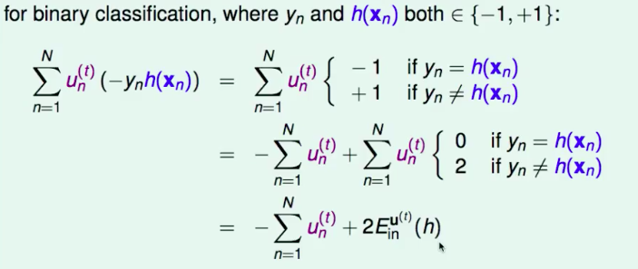
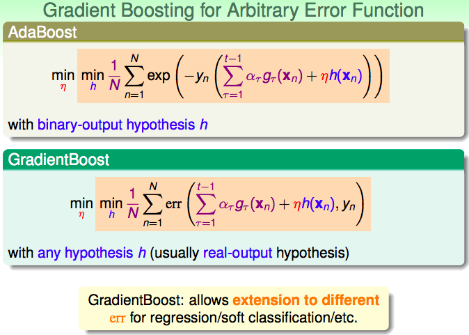
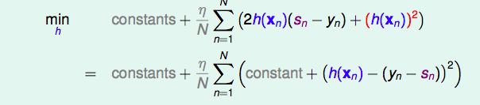
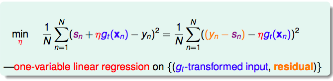
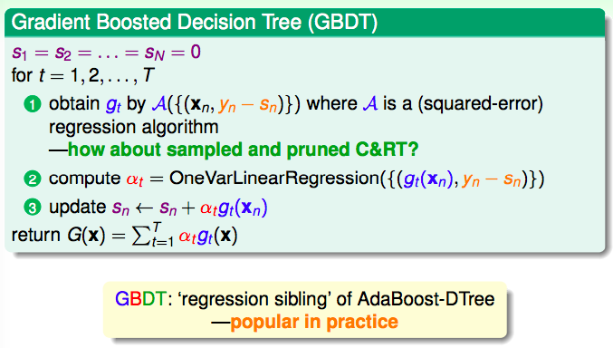

#  Lecture 11: Gradient Boosted Decision Tree

> 课件链接：[Hsuan-Tien Lin - gradient boosted decision tree](https://www.csie.ntu.edu.tw/~htlin/course/ml19spring/doc/211_handout.pdf)
>
> **Gradient Boosted Decision Tree(梯度增强树)**
>
> * Adaptive Boosted Decision Tree：自适应增强树
> * Optimization View of AdaBoost：自适应增强的优化视角
> * Gradient Boosting：梯度提升
> * Summary of Aggregation Models：聚合模型总结

## 1. Adaptive Boosted Decision Tree：自适应增强树

回顾上一章的随机森林算法：

> **funtion RandomForest(D)：**
>
> * For t=1,2,……,T
>   * 用Bootstrapping的方式从训练集$D$中抽取本轮所用数据集$\tilde{D}_t$；
>   * 用随机性更强的方式训练一棵决策树，即$g_t $=*Randomized-DTree*$(\tilde{D}_t)$；
> * 回传$G = Uniform(\{g_t\})$

类似的，我们可以很容易写出**AdaBoost-DTree算法**。

> **funtion AdaBoost-DTree(D)：**
>
> - For t=1,2,……,T
>   - 用$\mathbf{u}^{(t)}$给训练集D赋予权重；
>   - 在有权重信息的训练集上训练一棵决策树，即$g_t$=*DTree*($D, \mathbf{u}^{(t)}$)；
>   - 计算$g_t$的权重$\alpha_t$
> - 回传$G = LinearHypo(\{g_t, \alpha_t\})$

然而，CART演算法并没有说明如何训练带有权重信息的数据——我们需要一个**Weighted Decision Tree Algorithm**。

能够应用权重的算法(Weighted Algorithm)，也就是能够最小化带有权重的经验误差：

$$
min\ E_{in}^{\mathbf{u}}(h) = \frac{1}{N} \sum_{n=1}^N u_n · err(y_n, h(\mathbf{x}_n))
$$
因此，如果要把一个演算法调整成为能够应用权重的版本，需要将其内部涉及$E_{in}$的部分进行调整，换成$E_{in}^{\mathbf{u}}$；但对于决策树这种没有明显$E_{in}​$，其内部构造较为复杂的演算法来说，将其拆开重构是非常麻烦的。因此，我们最好将其当做黑箱，原封不动，而是在给其传入的训练数据上做手脚，使得传入的训练数据能够**反映**每笔资料的权重信息。

**一种可行的方法是**：根据权重对资料进行**重采样**，得到$\tilde{D}_t$，然后将该数据集传入决策树演算法中进行训练——权重大的数据，在采样的时候可能会抽到多次；权重小的数据，在采样的时候抽到的次数较少。这样，向演算法中传入的数据本身没有权重信息，但是通过重采样的方法，将权重信息融入了重采样得到的新数据集中。

训练出一棵决策树$g_t$后，需要计算其权重$\alpha_t = ln(\sqrt{\frac{1-\epsilon_t}{\epsilon_t}})$，其中$\epsilon_t$是$g_t​$带权重的分类错误率。

如果该决策树①是用所有样本训练出来的，且②完全长成(fully grown)，那么他的经验误差就是0，那么它的带权重的经验误差肯定也是0，因为它可以将每一个样本分类正确。那么$\epsilon_t$就为0，这样其对应的权重$\alpha_t$是无穷大！出现了**一棵树的"独裁"！**避免这样的情况，则需要弱一点的树$g_t$：

* pruned tree，为每一步的决策树剪枝，比如限制其depth；
* trained on some $\mathbf{x}_n$ rather than all $\mathbf{x}_n$，只用一部分训练数据训练，而不是涉及到每一个训练数据——重采样其实就是在做这样的事情，一些样本可能没有被采到；

**综上，AdaBoost-DTree = AdaBoost + sampling $\propto\ \mathbf{u}^{(t)}​$ + pruned DTree($\tilde{D}​$)** 。

如果将决策树的高度限制为1，那么AdaBoost-DTree就变成了AdaBoost-Stump——此时，权重信息比较容易加入演算法中，因此就不需要重采样了。

## 2. Optimization View of AdaBoost：自适应增强的优化视角

回顾AdaBoost算法：

> $\mathbf{u}^{(1)} = [\frac{1}{N},\frac{1}{N},\cdots,\frac{1}{N}]​$
>
> for $t=1,2,\cdots,T$
>
> 1. $g_t = A(D, \mathbf{u}^{(t)})$，这里A是在最小化基于权重$\mathbf{u}^{(t)}$的0/1误差；
> 2. 计算$g_t$的加权错误率$\epsilon_t$，然后计算$\Diamond_t$，根据规则更新得到$\mathbf{u}^{(t+1)}$；
> 3. 计算$\alpha_t​$；
>
> 回传$G(\mathbf{x}) =sign\Big(\sum_{t=1}^T \alpha_t g_t(\mathbf{x})\Big)​$

**样本权重的更新规则是**：对于被$g_t​$正确分类的点，即$y_ng_t(\mathbf{x}_n) \ge 0​$，将其权重除以$\Diamond_t​$；对于被$g_t​$错误分类的点，即$y_ng_t(\mathbf{x}_n) \le 0​$，将其权重乘以$\Diamond_t​$。我们可以将上面的规则合并起来：
$$
u_n^{(t+1)} = u_n^{(t)} · \Diamond_t^{-y_ng_t(\mathbf{x}_n)}
$$
又$ln(\Diamond_t) = \alpha_t$，因此：

$$
u_n^{(t+1)} = u_n^{(t)} · exp\Big(-y_n \alpha_t g_t(\mathbf{x}_n)\Big)
$$
从上式可以看出，样本的权重在不断迭代更新，有：

$$
u_n^{(T+1)} = \frac{1}{N} · exp\Big(-y_n \sum_{t=1}^T\alpha_t g_t(\mathbf{x}_n)\Big)
$$
因为$G(\mathbf{x}_n) = sign\Big(\sum_{t=1}^T \alpha_tg_t(\mathbf{x})\Big)​$，所以上式exp括号内的求和部分，其实是$G(\mathbf{x}_n)​$中没有做sign运算的那个"分数"。我们将这个分数，$\sum_{t=1}^T \alpha_t g_t(\mathbf{x})​$，称为{$g_t​$}们在$\mathbf{x}​$上的**voting score**。

这里，我们可以将$y_n·(voting\ score)​$看做是一种**Margin**：$y_n​$与voting score同号，则说明分类正确；两者乘积越大，说明置信度越高。对于Margin，我们当然希望越大越好，所以希望$y_n·(voting\ score)​$越大越好→exp($y_n·(voting\ score)​$)越小越好→$u_n^{(T+1)}​$越小越好！

**AdaBoost随着迭代次数的增加，$\sum_{n=1}^N u_n^{(t)}$会越来越小**——这正好符合上面large margin的"希望"，因为所有样本的权重之和越来越小，其实也就大概能说明每一个点的权重越来越小，也就说明每一个点的margin都越来越大——**因此，AdaBoost是一个不断达到Large margin的过程**。

**AdaBoost Error Function**

AdaBoost的过程中样本权重之和在不断减小，近似等价于AdaBoost是一个最小化下面式子**的过程**：

$$
\sum_{n=1}^N u_n^{(T+1)} = \frac{1}{N}\sum_{n=1}^N exp\Big(-y_n \sum_{t=1}^T \alpha_t g_t(\mathbf{x}_n)\Big)
$$
我们将$\sum_{t=1}^T \alpha_t g_t(\mathbf{x}_n)​$记做$s_n​$，那么AdaBoost最小化的式子可以写作：

$$
 \frac{1}{N}\sum_{n=1}^N exp\Big(-y_n s_n\Big)
$$
这里我们可以识别出一个error measurement，即$exp(-ys)​$，被称为exponential error measure，它是0-1误差的一个上界。**AdaBoost所做的事情，就是在最小化基于这个指数型损失函数的经验误差。**

真的吗？下面我们将从**梯度下降**的视角来证明这件事情。

回忆梯度下降：

$$
\mathop{min}\limits_{||\vec v||=1}\ E_{in}(\vec w_t + \eta \vec v) \approx E_{in}(\vec w_t) + \eta \vec v^T \nabla E_{in}(\vec w_t)
$$
梯度下降所做的事情是，在某一个点，看看该点周围方圆1单位之内，哪个方向函数值下降最大(这也就是解上面的最小化问题)，然后沿着该方向更新自变量，更新的大小由$\eta​$决定。

对于AdaBoost，在第t轮，它不是要更新$\mathbf{w}_{t-1}​$到$\mathbf{w}_{t-1} + \eta \mathbf{v}​$，而是要更新$\sum_{\tau=1}^{t-1}\alpha_{\tau}g_{\tau}(\mathbf{x}_n)​$到$\sum_{\tau=1}^{t-1}\alpha_{\tau}g_{\tau}(\mathbf{x}_n) + \eta h(\mathbf{x}_n)​$，即：

$$
\underset{h}{min}\ \hat{E}_{ADA} = \frac{1}{N} \sum_{n=1}^N exp(-y_n\Big(\sum_{\tau=1}^{t-1}\alpha_{\tau}g_{\tau}(\mathbf{x}_n) + \eta h(\mathbf{x}_n)\Big))
$$
我们知道$\frac{1}{N} exp(- y_n \sum_{\tau=1}^{t-1}\alpha_{\tau}g_{\tau}(\mathbf{x}_n))$等于$u_n^{(t)}$，因此上式可以转化为：

$$
\underset{h}{min}\ \sum_{n=1}^N u_n^{(t)} exp(-y_n \eta h(\mathbf{x}_n))
$$
运用泰勒展开(在原点附近)，我们可以将上面的最优化问题近似转化为：

$$
\underset{h}{min}\ \sum_{n=1}^N u_n^{(t)} (1-y_n \eta h(\mathbf{x}_n)) = \sum_{n=1}^N u_n^{(t)} - \eta \sum_{n=1}^N u_n^{(t)} y_n h(\mathbf{x}_n)
$$
因此，最小化问题也就等价为最小化：

$$
\underset{h}{min} \sum_{n=1}^N u_n^{(t)} (-y_n h(\mathbf{x}_n))
$$
对于二元分类问题，我们还可以对上式进行进一步的化简：

**因此，可以再进一步等价成：**

$$
\underset{h}{min}\ E_{in}^{\mathbf{u}^{(t)}}(h)
$$
**这正是AdaBoost中base algorithm做的事情！因此，AdaBoost所做的事情，就是从一个起点出发，利用梯度下降，一步步更新，逐渐最小化基于指数型损失函数的经验误差。**

到这里，我们都是假设$\eta$是给定的。但是，如果我们比较贪婪的话，在拿到$g_t$后，可以再针对$\eta​$来最小化经验误差：

$$
\underset{\eta}{min}\ \hat{E}_{ADA} = \sum_{n=1}^N u_n^{(t)}exp(-y_n \eta g_t(\mathbf{x}_n))
$$
这样决定$\eta​$，比直接固定一个较小的$\eta​$来说，往往能够更快收敛，因为"步子更大了"——greedily faster——**steepest descent**。

我们可以对上式进行化简，得到：

$$
\hat{E}_{ADA} = (\sum_{n=1}^N u_n^{(t)}) · \Big((1-\epsilon_t)exp(-\eta) + \epsilon_t exp(+\eta)\Big) 
$$
最优化上式，就是令偏导等于零，可以解得最优的解为$\eta_t = ln(\sqrt{\frac{1-\epsilon_t}{\epsilon_t}})​$，也就是AdaBoost中的$\alpha_t​$！

所以，**AdaBoost是steepest descent with approximate functional gradient**。

## 3. Gradient Boosting：梯度提升

基于上述分析，我们可以将指数型损失函数换成**任意其他类型的损失函数**，这样就得到了Gradient Boosting：

例如，我们可以利用GB解决Regression问题——**GradientBoost for Regression**。对于回归问题，我们选择平方误差$err(s,y) = (s-y)^2$，然后将紫色的求和项记做$s_n$，并将上述目标函数在$s_n$处进行泰勒展开：

$$
\underset{h}{min}\ \frac{1}{N} \sum_{n=1}^N err(s_n,y_n) + \frac{1}{N}\sum_{n=1}^N \eta h(\mathbf{x}_n)·\frac{\part err(s,y_n)}{\part s}|_{s=s_n}
$$
整理得到等价的最佳化问题：

$$
\underset{h}{min}\ \sum_{n=1}^N h(\mathbf{x}_n)·2(s_n-y_n)
$$
如果这样的话，解就是$h(\mathbf{x}_n) = -\infty · (s_n - y_n)​$。因此，我们应该给h加上一些限制，因为h的大小是没有意义的，大小我们可以通过之后的$\eta​$来调整——可以$$||·||​$$控制，但是这样就变成解一个带条件的最佳化问题，比较麻烦。受到正则化的启发，我们可以在上式中加上一个平方项作为惩罚，差不多等价于控制其大小：

解上述问题，就等价于解一个**基于平方误差的回归问题**：$\{(\mathbf{x}_n, y_n-s_n)\}$。

**因此，回归梯度提升，在每一轮中对残差进行回归，得到base predictor**。

同样，下面应该确定$\eta$，也就是$\alpha_t$：

可见，$\alpha_t$的确定也是做一个回归，是一个单变量的回归，用刚刚学到的$g_t$的转换对残差的回归。

**GBDT**

在回归梯度提升的时候，**用CART作为base algorithm进行回归**，因此叫做梯度提升回归树模型(Gradient boosted decision tree)。

 

## 4. Summary of Aggregation Models：聚合模型总结

**Blending Model**

已经有了许多不一样的$g_t$，想办法将它们合起来。三种类型：Uniform(均匀)，Non-uniform(非均匀)，Conditional(非线性)。均匀混合会提升算法的稳定性(降低方差)，而非均匀混合或非线性混合则会提升算法的复杂度，也就是提高算法的能力(降低偏差)，但此时要十分小心过拟合问题。

**Learning Model**

在学习$g_t$的过程中将它们合起来。三种类型：Bagging(uniform)，AdaBoost(线性)，DecisionTree(非线性)。将AdaBoost延伸，得到Gradient Boost。

**为什么聚合模型能够起作用？**

* 解决underfitting的问题：例如Boost类算法，AdaBoost和Gradient Boost；
* 解决overfitting的问题：例如Bagging算法。

## 5. Summary

* 可以将决策树算法作为AdaBoost的基算法，构造AdaBoost-DTree演算法。其中，权重信息通过重采样的方法传递给决策树演算法，并且需要进行树的修剪。
* 从最优化的视角看，AdaBoost每一轮训练$g_t$与计算$\alpha_t$的过程，实际上等价于某种"梯度下降"，只是在这里不是"向量空间"，而是"函数空间"。用这种steepest的梯度下降，AdaBoost在最小化基于指数型损失函数的经验误差，具体表现为随着迭代轮数的不断增加，样本权重之和在不断地迅速减小。
* 将AdaBoost中指数型损失函数换成任意其他类型的损失函数，得到梯度提升算法。例如，我们可以将指数型损失函数换成平方误差，这样可以得到解决回归问题的提升算法。

* 梯度提升回归树算法，即GBDT，每一轮用原始数据对残差做回归得到$g_t$，这里回归使用回归型决策树完成；系数$\alpha_t$由$g_t{(\mathbf{x}_n)}$对残差做无偏置项的回归得到。