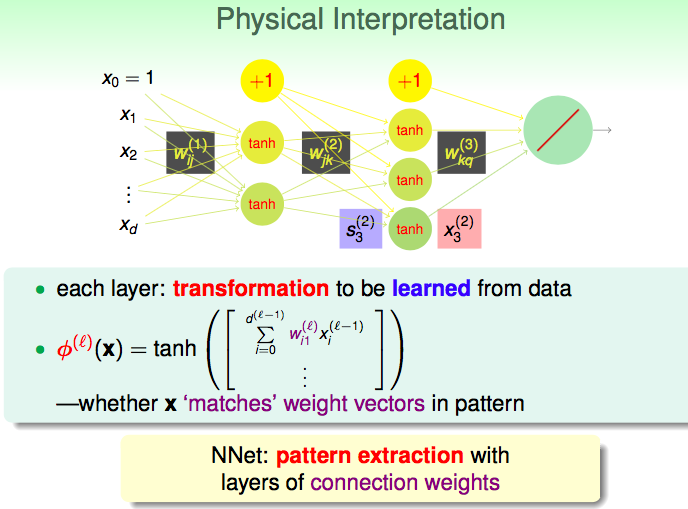
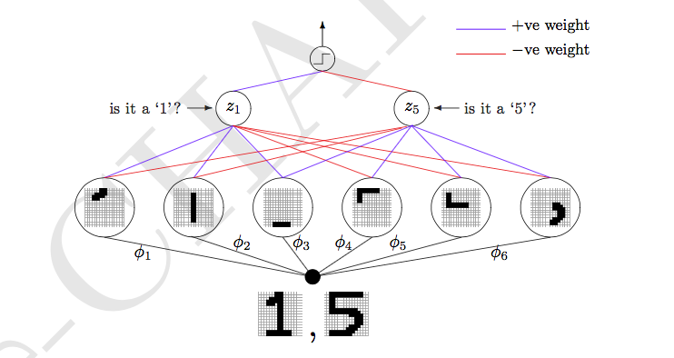
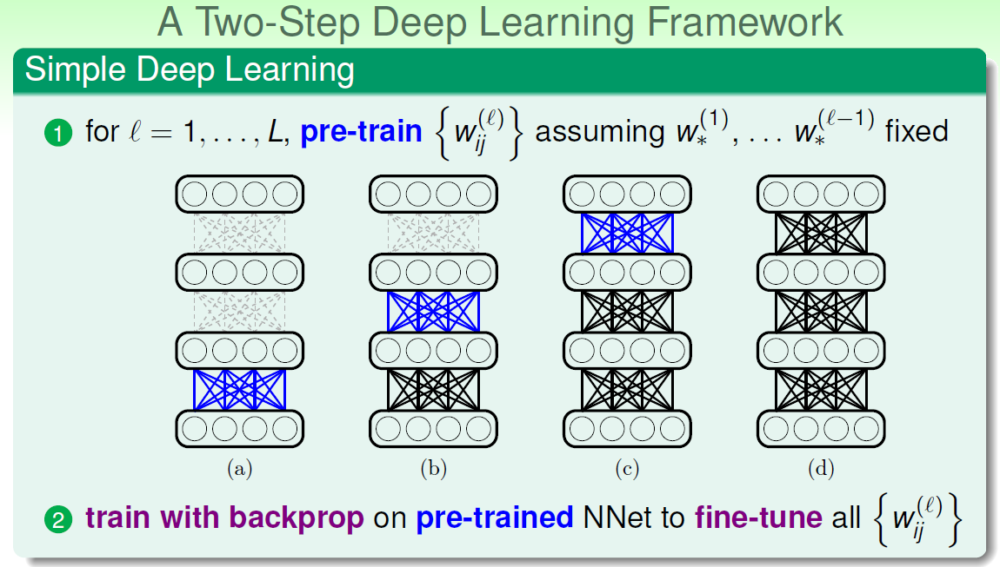
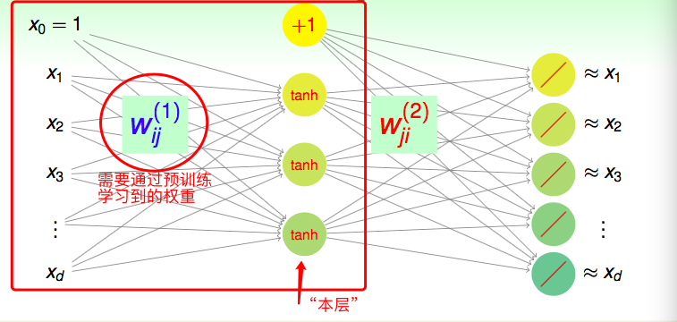

# Lecture 13: Deep Learning

> 课件链接：[Hsuan-Tien Lin - deep learning](https://www.csie.ntu.edu.tw/~htlin/course/ml19spring/doc/213_handout.pdf)
>
> **Deep Learning(深度学习)**
>
> * Deep Neural Network：深度神经网络
> * Autoencoder：自编码器
> * Denoising Autoencoder：降噪自编码器
> * Principal Component Analysis：主成分分析

## 一. Deep Neural Network：深度神经网络

**1. 神经网络的含义**

神经网络每一层的每一个神经元的作用是什么？表面上，一个神经元"拥有"一个自己的权重向量，例如第l层第j个神经元的权重向量为$\mathbf{w}_{*j}^{(l)}$，它会用自己的权重向量与上一层的输出向量，如$\mathbf{x}^{(l-1)}$，进行内积运算，然后将结果通过一个转换函数，得到一个数值，成为本层输出向量的一个组分；实质上，这个过程是——**Pattern feature extracted from data**，即从资料中**萃取某种模式**。例如：

* 第1层的第2个神经元，与其相联系的本层的权重为$\mathbf{w}_{*2}^{(1)}$；
* 原始数据$\mathbf{x}^{(0)}$经过与其内积，得到$s_{2}^{(1)} = \mathbf{w}_{*2}^{(1)} · \mathbf{x}^{(0)}$；
* 如果$s_{2}^{(1)}$比较大，说明，$\mathbf{w}_{*2}^{(1)}$与原始数据$\mathbf{x}^{(0)}$在某种程度上比较"像"——因为两个向量越是相似，其内积越大；
* 因此，与$\mathbf{w}_{*2}^{(1)}$进行内积，好像是给$\mathbf{x}^{(0)}$做某种确认，某种"特征"的确认——如果内积大，则确认有这种特征；如果内积小，则确认没有这种特征；
* 推广到任意一个神经元：每一个神经元都对应一个本层的权重向量，该权重向量相当于"学习到的一个特征"，或者叫做"学习到的一种特征确认"；它确认的是上一层的输出向量是否具备它所学习到的特征——如果具备，则反映为内积大；如果不具备，则反映为内积小；
* 因此，一层神经元，也就是在为上一层的输出向量做**一系列特征确认**；
* $\phi^{(l)}$，是l层神经元们对上一层输出结果的特征确认，其确认结果为$\phi(\mathbf{x}^{(l-1)})$；$\phi^{(l)}$由$\phi^{(l)}_1, \phi^{(l)}_2, \cdots$构成，每一个对应一个神经元；
* 每**一个神经元 = 一个特征确认**，也就说明每个神经元已经"学到了"一个特征。

那么，需要多少神经元(neurons)？需要多少层(layers)？——**结构**是怎样的？可以①自己设计，当然也可以②通过validation的方式选择。即，structural decisions:

* Your design(subjectively)
* Validation(objectively)

**2. 浅层神经网络(Shallow)与深层神经网络(Deep)**

神经网络两种基本的结构：

* Shallow NNet：浅的，即hidden layer很少；
  * 训练时更有效率；
  * 关于结构的决定比较简单；
  * 有强的理论保证——即使层数少但有足够多的神经元也可以很powerful；
* Deep NNet：深的，即hidden layer很多；
  * 训练很困难；
  * 关于结构的决定也很复杂；
  * 非常强大(arbitrary powerful)；
  * **meaningful：能够得到有含义的特征**。

**3. 深度学习的Meaningfulness**

为什么说深度学习较"浅层学习"来说，能够得到更多更有含义的特征？我们用手写数字识别的例子来理解。

如上图所示，我们的input是一张手写数字的图片。第一层hidden layer由6个神经元构成，分别对应一个$\phi_i$。input会被每一个神经元进行特征确认，确认结果为$\phi_i(\mathbf{x})$。由图知，当input是手写1的图片时，$\phi_1, \phi_2, \phi_3$的确认结果很大，令其为1；$\phi_4, \phi_5, \phi_6$的确认结果很小，令其为-1。因此，input为手写1的图片时，第一层的输出为$(+1,+1,+1,-1,-1,-1)^T$。对于第二层，左边的神经元权重为$(+1,+1,+1,-1,-1,-1)^T$，是在做"是否是1"的确认，因为它的权重就代表如果是1那么第一层输出"应该"有的结果。因此，对于手写1的图片，第二层左边的神经元输出为6；同理，可以得到右边神经元的输出为-4。第三层唯一的神经元在做是否是1的确认，因此权重为$(+1,-1)^T$，对于1的图片最终输出为10——被正确识别。可见：

* 每一层表面上是在做特征转换，实际上是在做特征确认——转换得到的新向量包含着特征确认的信息——也可以理解为萃取出了新的特征；
* 网络越深，萃取出的特征越抽象，信息量越大

因此，神经网络越深，越可能学到不同的、更加复杂的特征——因为每一层学到的特征，都是基于上一层学到的特征，所以越deep的layer，学到的特征越抽象、越"深层次"、越复杂、越能靠近问题背后原始的pattern。

**4. 深度学习的挑战与暂时的解决方案**

* difficult structural decisions：设计网络结构很纠结，多少神经元？多少层？每层多少？怎么连接？
  * 对问题本身的了解(domain knowledge)：如CNN，就是专门处理图像问题的神经网络——图片的像素之间是有物理上位置关系的，因此，在设计神经元之间的连接时，只让附近的一批像素连接到下一层的同一个神经元上(隔太远的像素就不要连到同一个下一层神经元上了)；
* high model complexity：神经元与层数上来之后，模型的VC维很大，容易过拟合；
  * 但是大数据时代，虽然复杂度高，但是有大的数据量去对冲；
  * 正则化(噪声导向，noise-tolerant)：
    * dropout(tolerant when network corrupted)
    * denosing(tolerant when input corrupted)
* hard optimization problem：不是凸优化问题，神经元与层数一多，参数更多，局部最小点也变多，更容易卡住；
  * 小心地选择起始点，以避免坏的局部山谷——pre-training；
* huge computational complexity：计算复杂度显而易见很大；
  * 大数据对复杂度好，但对计算就不是很好了……
  * GPU并行计算。

**"Two-step"深度学习框架(包含预训练)**

1. 对于层数$l = 1,\cdots, L$，在假定$w_*^{(1)}, \cdots, w_*^{(l-1)}$确定的情况下，预训练得到该层参数$w_{ij}^{(l)}$；
2. 用backprop的方法在预训练的神经网络上再进行训练，对上一轮得到的参数进行微调(fine-tune)。

## 二. Autoencoder：自编码器

**1. 信息保留型编码: Information-preserving encoding**

上一节提到，每一层的权重都类似于特征确认，上一层的输出经过本层权重的处理，得到一系列"基于特征确认的新的特征"——feature transform，当然也可以看做是encoding。

做pre-training时，我们无法使用labels对于某一层的权重进行确认。因为预训练时只训练该层的权重，而不会涉及该层之后各层的权重，因此自然无法与label产生联系，也就无法使用label的信息——因此，对于每层的预训练，好像是**无监督学习任务**。

之前我们用label训练权重，好的权重会给我们好的$E_{in}$；现在不能用label进行训练，那什么才是好的权重呢？**能够最大限度保留(上一层)信息的权重，是好的权重**。也就是，对于上一层的输出，经过本层权重的encode，再经过某种decode，能够被还原。如下图所示：

* Autoencoder：$d-\tilde{d}-d$结构的神经网络，目标是$g(\mathbf{x}) \approx \mathbf{x}$；
* 自编码本质上类似于identity function；
* 上图中$w_{ij}^{(1)}$被称为encoding weights，$w_{ij}^{(2)}$被称为decoding weights。

**2. 信息保留型的权重有什么含义**

1. 对监督式学习来说：如果某组权重能够进行信息保留，这说明该组权重已经识别出信息中的一些关键特征(hidden structures)——那么，对于一般的监督式学习，我们就可以用该组权重作为一个理想的特征转换$\Phi(\mathbf{x})$。
2. 对非监督式学习来说：
   * 用于density estimation：稠密的地方，自编码器的表现很好，$g(\mathbf{x}) \approx \mathbf{x} $；稀疏的地方，自编码器的表现不好；
   * 用于outlier detection：大多数点存在的地方，自编码器的表现很好，$g(\mathbf{x}) \approx \mathbf{x}$；而异常点，也就是不合群的点，自编码的表现会很差。

**3. 基本的Autoencoder**

$d-\tilde{d}-d$结构的浅层神经网络，损失函数是：
$$
\sum_{i=1}^d \Big( g_i(\mathbf{x}) - x_i\Big)^2
$$

* 很容易进行backprop，因为很浅；
* 通常考虑$\tilde{d} < d$，压缩；
* 资料是：$\{(\mathbf{x}_1, y_1 = \mathbf{x}_1), (\mathbf{x}_2, y_2 = \mathbf{x}_2), \cdots, (\mathbf{x}_N, y_N=\mathbf{x}_N)\}$；
* 可以被看做是无监督学习，不需要用到label；
* 有时，我们会加入$w_{ij}^{(1)} = w_{ji}^{(2)}$的限制(编码权重=解码权重)，作为正则化——不需要那么多不同的参数。

**4. 利用Autoencoder进行pre-training**

Deep Learning with Autoencoders:

> 1. 对于层数$l = 1,\cdots, L$，在假定$w_*^{(1)}, \cdots, w_*^{(l-1)}$确定的情况下，预训练得到该层参数$w_{ij}^{(l)}$；
>    * 等价于，在数据$\Big\{\mathbf{x}^{(l-1)}\Big\}$上训练基本的Autoencoder，这里$\tilde{d} = d^{(l)}$；
> 2. 用backprop的方法在预训练的神经网络上再进行训练，对上一轮得到的参数进行微调(fine-tune)。

最后，还有很多fancier autoencoders。

## 三. Denoising Autoencoder：降噪自编码器

**1. 深度学习中的正则化**

避免高的模型复杂度，正则化是非常必须的：

* 给网络结构加上限制：例如CNN是非全连接；
* 添加正则项；
* 早停法；

**2. 复习: 过拟合的原因**

①数据量少；②杂讯；③模型复杂度高。当模型和数据量都确定时，只能从降低noise的影响入手处理过拟合。

直接做法——data cleaning。另一种思想：**adding noise to data**，将杂讯加入资料中。因为，更加稳健的antoencoder应该能够容忍一些杂讯，也就是能够使$g(\tilde{\mathbf{x}}) \approx \mathbf{x}$，其中$\tilde{\mathbf{x}}$是在$\mathbf{x}$上加了一点点杂讯得到的。

这种在有一些杂讯的资料上训练出的更加稳健的antoencoder被称为denoising autoencoder：在$\{(\tilde{\mathbf{x}}_1, y_1 = \mathbf{x}_1), (\tilde{\mathbf{x}}_2, y_2 = \mathbf{x}_2), \cdots, (\tilde{\mathbf{x}}_N, y_N=\mathbf{x}_N)\}$上训练basic antoencoder，其中$\tilde{\mathbf{x}}_n = \mathbf{x}_n + artificial\ noise$。

## 四. Principal Component Analysis：主成分分析

前两节提到的basic antoencoder和denoising autoencoder，本质上都是nonlinear autoencoder，因为其中包含了非线性的transformation function *tanh*。

本节将介绍一种特殊的linear autoencoder。

线性的autoencoder其实就是将tanh函数去掉。因此，线性autoencoder的第k个输出可以表示为：
$$
h_k(\mathbf{x}) = \sum_{j=0}^{\tilde{d}}\Bigg(w_{jk}^{(2)}\sum_{i=0}^d w_{ij}^{(1)}x_i\Bigg)
$$
加上一些条件，我们将得到一个special linear autoencoder：

* 除去input中的$x_0$，**使下标i与下标k的取值范围相同**（此前i能够取到0，k不能取0）；
* 限制$w_{ij}^{(1)}= w_{ji}^{(2)} =  w_{ij}$：只有一组权重，因此可以写成矩阵$\mathbf{W}  = [w_{ij}]$，形状是$d × \tilde{d}$——每一列，是第1层每个神经元的权重——高瘦型；
* 假设$\tilde{d} < d$；

$$
h_k(\mathbf{x}) = \sum_{j=0}^{\tilde{d}}w_{kj}\sum_{i=1}^d w_{ij}x_i
$$

用矩阵形式可以写成：
$$
h(\mathbf{x}) = \mathbf{W}\mathbf{W}^T\mathbf{x}
$$
**线性自编码器的损失函数**
$$
E_{in}(h) = E_{in}(\mathbf{W}) = \frac{1}{N} \sum_{n=1}^N ||\mathbf{x}_n - \mathbf{W}\mathbf{W}^T\mathbf{x}_n||^2
$$
其中$\mathbf{W}$是$d × \tilde{d}$型的矩阵。

> **线性代数知识**：
>
> * 特征值分解：$\mathbf{W}\mathbf{W}^T = \mathbf{V}\Gamma\mathbf{V}^T$
>   * 实质是对称矩阵的特征值分解，因此是转置；
>   * 矩阵$\mathbf{V}$是正交矩阵，$d×d$，即$\mathbf{V}^T\mathbf{V}=\mathbf{V}\mathbf{V}^T = \mathbf{I}_d$；
>   * 矩阵$\Gamma$是对角矩阵，$d×d$，对角线非零值的个数$\le rank \le \tilde{d}$；
> * 因此，$\mathbf{W}\mathbf{W}^T\mathbf{x}_n = \mathbf{V}\Gamma\mathbf{V}^T\mathbf{x}_n$
>   * $\mathbf{V}^T\mathbf{x}_n$相当于将$\mathbf{x}_n$进行坐标变换——rotate或reflect，但长度不变；
>   * $\Gamma(\cdots)$：相当于将$d-\tilde{d}$数目的维度置零，剩余维度放缩；
>   * $\mathbf{V}(\cdots)$：将向量重新变换回原来的坐标空间；
> * $\mathbf{x}_n = \mathbf{V}\mathbf{I}\mathbf{V}^T\mathbf{x}_n$；
> * $E_{in} = \frac{1}{N} \sum_{n=1}^N || \mathbf{V}\mathbf{I}\mathbf{V}^T\mathbf{x}_n -  \mathbf{V}\Gamma\mathbf{V}^T\mathbf{x}_n||^2$

至此，原本针对$E_{in}$的最优化问题转化为：
$$
\underset{\mathbf{V}}{min}\ \underset{\mathbf{\Gamma}}{min}\ \frac{1}{N} \sum_{n=1}^N || \mathbf{V}\mathbf{I}\mathbf{V}^T\mathbf{x}_n -  \mathbf{V}\Gamma\mathbf{V}^T\mathbf{x}_n||^2
$$
首先，我们将针对$\Gamma$进行最优化。

因为旋转映射型坐标系变换不影响长度，因此可以将第一个V去掉。相当于$min_{\Gamma} ||(\mathbf{I}-\mathbf{\Gamma})(some\ vector)||^2$，因此$\mathbf{I}-\mathbf{\Gamma}$的对角线上越多0越好，因此最佳的$\Gamma$为：
$$
\Gamma = \begin{bmatrix} \mathbf{I}_{\tilde{d}}&0\\0&0 \end{bmatrix}
$$
现在，最优化问题转换为：
$$
\underset{\mathbf{V}}{min} \sum_{n=1}^N ||\begin{bmatrix} 0&0\\0&\mathbf{I}_{d-\tilde{d}} \end{bmatrix} \mathbf{V}^T \mathbf{x}_n||^2
$$
其次，我们将针对$\mathbf{V}$进行最优化。

将最小化问题转化为最大化问题($\mathbf{V}^T \mathbf{x}_n$是一个向量，最小化式子中的矩阵是在提取它的一部分维度，并做最小化动作；由于向量长度是一定的，那么等同于最大化没有提取到的那一部分维度)：
$$
\underset{\mathbf{V}}{max} \sum_{n=1}^N ||\begin{bmatrix} \mathbf{I}_{\tilde{d}}&0\\0&0 \end{bmatrix} \mathbf{V}^T \mathbf{x}_n||^2
$$
当$\tilde{d} = 1$时，只有$\mathbf{V}^T$的第一行起作用，记做$\mathbf{v}^T$，此时最优化问题转换为：
$$
\underset{\mathbf{v}}{max} \sum_{n=1}^N ||\mathbf{v}^T\mathbf{x}_n||^2 = \sum_{n=1}^N \mathbf{v}^T\mathbf{x}_n \mathbf{x}_n^T\mathbf{v}
$$
由于$\mathbf{v}^T$是正交矩阵中的一行，因此$\mathbf{v}^T\mathbf{v} = 1$——**有条件的最佳化问题**——拉格朗日乘子法，得到，最佳的$\mathbf{v}$需要满足：
$$
\sum_{n=1}^N \mathbf{x}_n \mathbf{x}_n^T \mathbf{v} = \lambda \mathbf{v}
$$
因此，最佳的$\mathbf{v}$是$X^TX$的特征向量。将上式代入目标函数中，得：
$$
\underset{\mathbf{v}}{max}\ \ \mathbf{v}^T \sum_{n=1}^N \mathbf{x}_n \mathbf{x}_n^T\mathbf{v} = \mathbf{v}^T \lambda \mathbf{v} = \lambda
$$
因此，最佳的$\mathbf{v}$是$X^TX$的**最大特征值对应的那个特征向量**（当然也要正规化一下使其模为1）——**topmost**。

**直接推广**：$\{\mathbf{v}_j\}_{j=1}^{\tilde{d}}$时，就找$X^TX$前$\tilde{d}$大特征值对应的特征向量"们"；而最佳的$\{\mathbf{w}_j\} = \{\mathbf{v}_j\ with\ I[\gamma_j = 1]\}$。

**Summary**：linear autoencoder做的事情就是，把资料矩阵$X^TX$计算出来后，进行特征值分解，拿到"最好的(对应特征值最大的)"$\tilde{d}$个特征向量。

