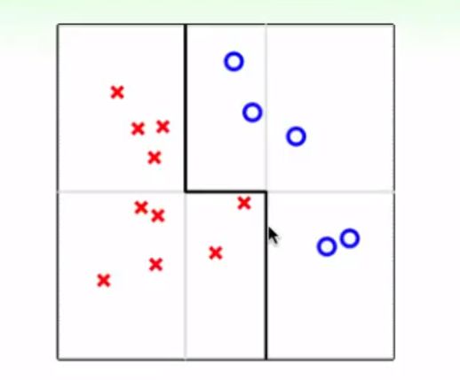
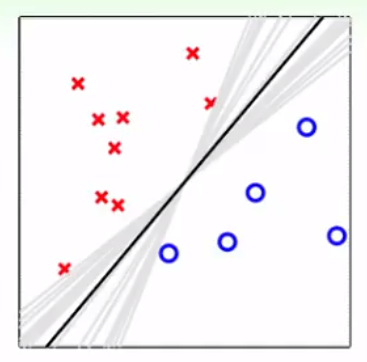
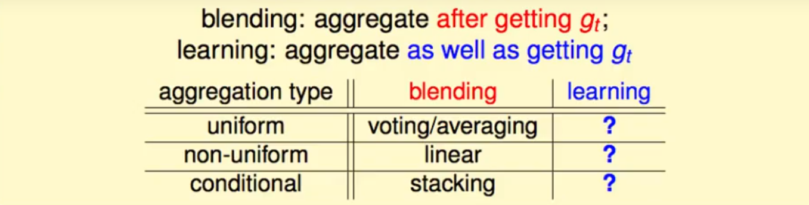
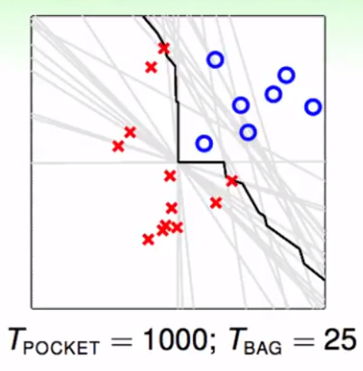

# Lecture 7：Blending and Bagging

> 课件链接：[Hsuan-Tien Lin - blending and bagging](https://www.csie.ntu.edu.tw/~htlin/course/ml19spring/doc/207_handout.pdf)
>
> **Blending and Bagging(混合与套袋)**
>
> * Motivation of Aggregation: 聚合的动机
> * Uniform Blending: 均匀混合
> * Linear and Any Blending: 线性混合与任意混合
> * Bagging (Bootstrap Aggregation): 套袋法

## 1. Motivation of Aggregation：聚合的动机

**Aggregation models(聚合模型)**：mix or combine hypotheses (for better performance)——将不同的hypothesis组合起来，以达到更好的表现。

假设现有T个假说$g_1, \cdots, g_T$，它们根据今天的输入预测明天的股票会涨还是会跌(二元分类问题)——$g_t(\mathbf{x}) \in \{-1,+1\}$。从聚合模型的视角，有以下几种常见的聚合方式：

1. 选择其中“最值得信赖的”，也就是表现最好的——等价于**Validation**：

$$
G(\mathbf{x}) = g_{t_*}(\mathbf{x})\ with\ t_*=argmin_{t \in \{1,2,\cdots,T\}}E_{val}(g_t^-)
$$

2. 均匀混合所有假说预测的结果，**uniformly**：

$$
G(\mathbf{x}) = sign \Big(\sum_{t=1}^T 1·g_t(\mathbf{x})\Big)
$$

3. 非均匀混合所有假说预测的结果，**non-uniformly**：
	* 包括第一种情况：$\alpha_t = I \Big[E_{val}(g_t^-)\ smallest \Big]$
	* 包括第二种情况：$\alpha_t = 1$

$$
G(\mathbf{x}) = sign \Big(\sum_{t=1}^T \alpha_t·g_t(\mathbf{x})\Big)\ with\ \alpha_t \ge 0
$$

4. 按照不同情况混合所有假说结果，**conditionally**：
	* 包括第三种：$q_t(\mathbf{x}) = \alpha_t$，也就包含了上面所有的情境

$$
G(\mathbf{x}) = sign \Big(\sum_{t=1}^T q_t(\mathbf{x})·g_t(\mathbf{x})\Big)\ with\ q_t(\mathbf{x})\ge 0
$$

**聚合的好处**

对于Validation，我们要用$E_{val}(g_t^-)$来选择$t_*$，而不能用$E_{in}(g_t)$，因为会付出VC维的代价。那么这也就需要保证，$g_t^-$中至少有一个足够好(strong)。所以，用Validation来做选择，依赖一个比较强的假说；但聚合往往并不需要，该方法可以把一些弱弱的(weak)假说集成起来，形成一个较强的聚合模型。

**好处1**：如上图所示，将一些非常弱的hypothesis（e.g. 决策树桩）均匀混合起来（投票，voting），可以拟合出较复杂的边界，即$G(\mathbf{x})$很强——类似于**feature transform**；

**好处2**：如上图所示，将不同的PLA的结果均匀混合起来，可以拟合出比较**中性**的边界——类似于**regularization**。

因此，适当的聚合能够得到表现更好的hypothesis。

## 2. Uniform Blending：均匀混合

**“聚合(aggregate)”**的一种情况是**“混合(blending)”**，表示：在已知$g_t$的前提下，将其聚合起来。

**1）均匀混合：分类问题**

uniform blending for classification = voting

已知$g_t$，一人一票，等权重均匀混合，得到的聚合模型如下：

$$
G(\mathbf{x}) = sign \Big(\sum_{t=1}^T 1·g_t(\mathbf{x})\Big)
$$

* 如果$g_t$都很类似，那么均匀混合起来得到的聚合模型应该没有什么效力；
* 如果$g_t$很不一样，那么聚合模型应该可以发挥作用，因为
* 、多数可以修正少数的错误；
* 对于多类别问题，选择得票最多的类别：

$$
G(\mathbf{x}) = \underset{1 \le k \le K}{argmax} \sum_{t=1}^T I \Big[g_t(\mathbf{x})=k\Big]
$$

**2）均匀混合：回归问题**
$$
G(\mathbf{x}) = \frac{1}{T}\sum_{t=1}^T g_t(\mathbf{x})
$$

* 如果$g_t$都很类似，那么均匀混合起来得到的聚合模型应该没有什么效力；
* 如果$g_t$很不一样，比如一些$g_t(\mathbf{x}) > f(\mathbf{x})$，一些$g_t(\mathbf{x}) < f(\mathbf{x})$，那么平均起来的话可能更加中肯、精确。

因此，如果要求聚合模型能够发挥效力，必须保证聚合的个体**“非常不同(diverse)”**——只要很不同，即使很简单的个体，聚合起来也会非常强大。

**3）均匀混合的理论保证**

以**回归形式**为例：

$$
G(\mathbf{x}) = \frac{1}{T}\sum_{t=1}^T g_t(\mathbf{x})
$$
固定$\mathbf{x}$，有：

$$
\underset{t}{avg}\Big( (g_t(\mathbf{x})-f(\mathbf{x}))^2 \Big) = \underset{t}{avg}\Big( (g_t(\mathbf{x})-G(\mathbf{x}))^2 \Big) + (G(\mathbf{x})-f(\mathbf{x}))^2
$$
两边对$\mathbf{x}$求期望得：

$$
\underset{t}{avg}\Big( E_{out}(g_t)\Big) = \underset{t}{avg}\Big( \epsilon (g_t-G)^2 \Big) + E_{out}(G) \ge E_{out}(G)
$$
上式说明，**单一hypothesis的(平均)表现要比均匀混合模型的表现差。**

**4）偏差-方差**

现在暂时考虑某一固定的演算法$A$。迭代T次，$t=1,2,\cdots, T$：

1. 从分布P上i.i.d.出N笔资料，记做$D_t$;
2. 用某一固定的演算法根据上述数据学习，得到$g_t = A(D_t)$；

令迭代次数趋近于无穷大，则最后：

$$
\overline{g} = \underset{T → \infty}{lim}G = \underset{T → \infty}{lim} \frac{1}{T} \sum_{t=1}^T g_t = \underset{D}{\epsilon}\ A(D)
$$
该演算法在看过各种五花八门的数据集后，产生出五花八门的hypothesis，然后混合起来，得到的就是$\overline{g}$。

之前我们有：

$$
\underset{t}{avg}\Big( E_{out}(g_t)\Big) = \underset{t}{avg}\Big( \epsilon (g_t-G)^2 \Big) + E_{out}(G) \ge E_{out}(G)
$$
现在我们有（$t → \infty$）：

$$
\underset{t}{avg}\Big( E_{out}(g_t)\Big) = \underset{t}{avg}\Big( \epsilon (g_t-\overline{g})^2 \Big) + E_{out}(\overline{g})
$$

* LHS：演算法表现的期望值，expected performance of A；
* RHS：**expected deviation to consensus(variance)+ performance of consensus(bias)**，前者可以理解为对“共识”的偏离，后者可以理解为演算法输出假设们的“共识”的表现。

因此，一个演算法的平均表现，可以被拆为两个部分：“共识”的表现，以及每个输出假设离“共识”有多远。

所以，我们做聚合，其实相当于**减小variance**。

## 3. Linear and Any Blending：线性混合与任意混合

**1）线性非均匀混合**

已知$g_t$，但每个人的票数不等，是非均匀混合：

$$
G(\mathbf{x}) = sign \Big(\sum_{t=1}^T \alpha_t·g_t(\mathbf{x})\Big)\ with\ \alpha_t \ge 0
$$
如何决定$\alpha_t$？可能我们希望$E_{in}$最小：

$$
\underset{\alpha_t \ge 0}{min}\ E_{in}(\mathbf{\alpha})
$$
因此，对于**回归问题**，我们就是要解：

$$
\underset{\alpha_t \ge 0}{min}\ \frac{1}{N}\sum_{n=1}^N\Big(y_n - \sum_{t=1}^T\alpha_t g_t(\mathbf{x}_n)\Big)^2
$$
这里，我们可以把上述过程看做**transformation+linear regression**：

* 首先将每个$\mathbf{x}$透过各个$g_t$，得到新的向量$(g_1(\mathbf{x}),g_2(\mathbf{x}), \cdots, g_T(\mathbf{x}))$；
* 然后再在转换过后的数据上，进行线性回归，得到$\mathbf{\alpha}$。

特别的，$\alpha_t \ge 0$的限制可以除去，因为负数相当于投反票。

**2）线性非均匀混合 vs Selection**

现实中，$g_t \in \mathcal{H}_t$ 通过最小化$E_{in}$得到。若此，我们就不可以再用$E_{in}$来选择$\alpha_t$，否则会过拟合。因此，我们需要切割出一部分资料作为验证集，使用Validation的方法：

* 从$E_{train}$上训练一堆$g_t^-$；
* 然后通过最小化$E_{val}$选$\alpha_t$。

**3）具体操作**

**Step 1：**

* 从$D_{train}$中训练各个$g_t^-$：$g_1^-, g_2^-, \cdots, g_T^-$。

**Step 2：**

* 将$D_{val}$中的每个$(\mathbf{x}_n, y_n)$进行转换得到$(\mathbf{z}_n, y_n)$，其中$\mathbf{z}_n = \Phi^-(\mathbf{x}_n) = \Big(g_1^-(\mathbf{x}_n), g_2^-(\mathbf{x}_n), \cdots, g_T^-(\mathbf{x}_n)\Big)$。

**Step 3：**

* 计算$\mathbf{\alpha} = Lin\Big(\{(\mathbf{z}_n, y_n)\}\Big)$，并返回$G_{LINB}(\mathbf{x}) = LinH(innerprod(\mathbf{\alpha} , \Phi(\mathbf{x})))$——这里不是$\Phi^-$而是$\Phi$，即最后还要用整个数据集（$D_{train}+D_{val}$）训练出每一个$g_t$，而不是用之前的$g_t^-$。

当然，我们在第三步中，可以不用线性模型，采用**任意模型**均可：

**Another Step 3：**

* 计算$\tilde{g} = Any\Big(\{(\mathbf{z}_n, y_n)\}\Big)$，并返回$G_{ANYB}(\mathbf{x}) = \tilde{g}(\Phi(\mathbf{x}))$。

上一步就是**Any blending**：

* 非常强大，也就是第三种conditional blending = **Stacking**
* 容易过拟合。 

## 4. Bagging：套袋法

__对于聚合模型，$g_t$越不一样越好。怎么让学到的$g_t$越不一样？我们可以考虑__：

* 用不同的模型：$g_1 \in \mathcal{H}_1, g_2 \in \mathcal{H}_2, \cdots$
* 用不同的参数：梯度下降时$\eta = 0.001, 0.01, 0.1, \cdots$
* 算法本身的随机性：如PLA，再加上不同的随机数种子；
* __数据的随机性__：交叉检验时，每个$g_v^-$就是用不同的数据训练出来的——__Bagging的启发点__

__下面，我们尝试用同样一份资料，制造出不同的$g$，而非$g^-$。__

回顾之前所推导的Bias-Variance：

**expected performance of A = expected deviation to consensus + performance of consensus**

其中，consensus $\overline{g}$ = expected $g_t$ from $D_t \sim P^N$

我们希望拿到$\overline{g}$，它比直接将演算法A用一次在D上更好（更稳定），但是不可能：

* 首先，需要无限多个$g$，然后平均起来，不可能；
* 其次，我们手头只有一个资料集D。

妥协：

* 拿出有限但足够多的$g$；
* 想办法从仅有的一个资料集中产生出多笔略微互相不同的资料集——**Bootstrapping**：实质是re-sample。

**Bootstrapping**

从现存的资料集D中**有放回(with replacement)**地取N笔资料，构成一个新的资料集$\tilde{D}_t$——**有放回去的动作**，因此一笔资料可能被选到好几次，也可能一次都没有被选到。这个新的资料集$\tilde{D}_t$被称为**bootstrap sample**。当然，也不一定非要是N笔。

所以，我们现在就有Bootstrap aggregation的概念：每一次拿到一个bootstrap sample $\tilde{D}_t$，然后训练一个$g_t = A(\tilde{D}_t)$；最后把T个$g$**均匀混合**起来：$G = Uniform\Big(\{g_t\}\Big)$

**Bagging = Bootstrap aggregation**：A simple **meta algorithm** on top of **base algorithm** A——Bagging是一个上层算法，叫meta；它利用（组合）了其他算法的输出，这里其他算法就是base。

示例：base algorithm是PLA的bagging

**注意，当base algorithm对数据的随机性十分敏感的时候，bagging的效果非常好**。即base algorithm为不稳定（unstable）型的——数据集稍微变一点点，训练出来的输出假说就很不一样——例如，决策树。

## 5. Summary

* Aggregation Model有两大好处：
  * 第一，作用类似于特征转换，能够生成更加复杂的边界；
  * 第二，作用类似于正则化，能够得到更加“中庸”的边界。
* 从均匀混合的理论保证中我们得到了两个发现：
  * 第一，混合模型的表现比单一模型的平均表现好；
  * 第二，对于同一种演算法，其均匀混合的极致就代表了该演算法的“共识”，也就是该演算法的真正效力；该演算法表现的期望值，等于这种“共识”加上“波动”水平。
* 面对线性非均匀混合，我们往往需要进行two-level learning：在训练集上训练出不同的hypothesis，然后用它们进行feature transform，再在验证集上学习混合系数。Any Blending，又被称为Stacking，过程与之类似。
* Bagging的核心是Bootstrapping，即从同一笔资料中采用有放回抽样的方法，产生多笔不同的资料，进而训练出多个不同的hypothesis，然后均匀混合。其实质是在逼近演算法的“共识”。因此，Bagging适用于unstable的演算法，例如决策树。

